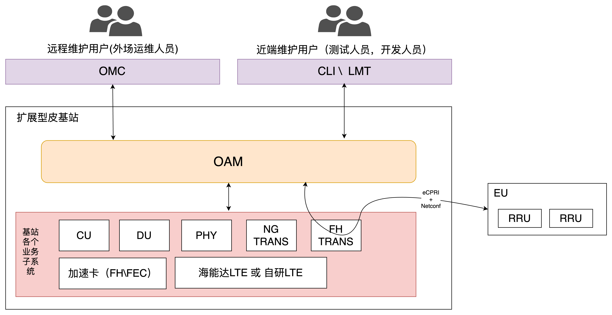
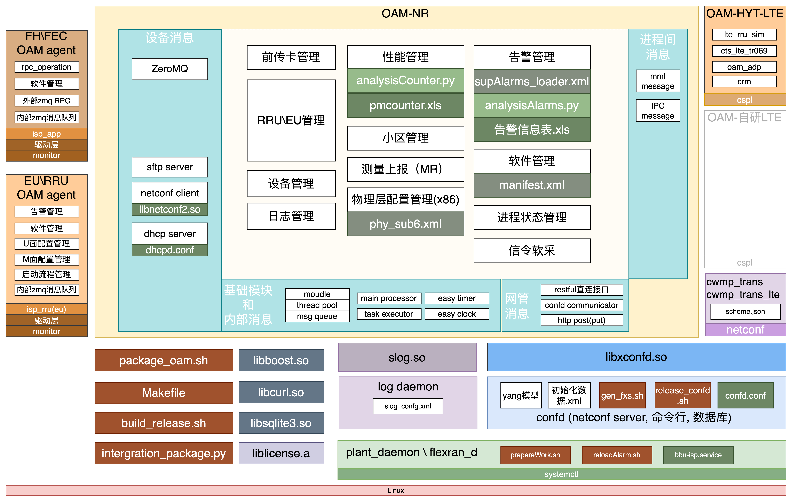
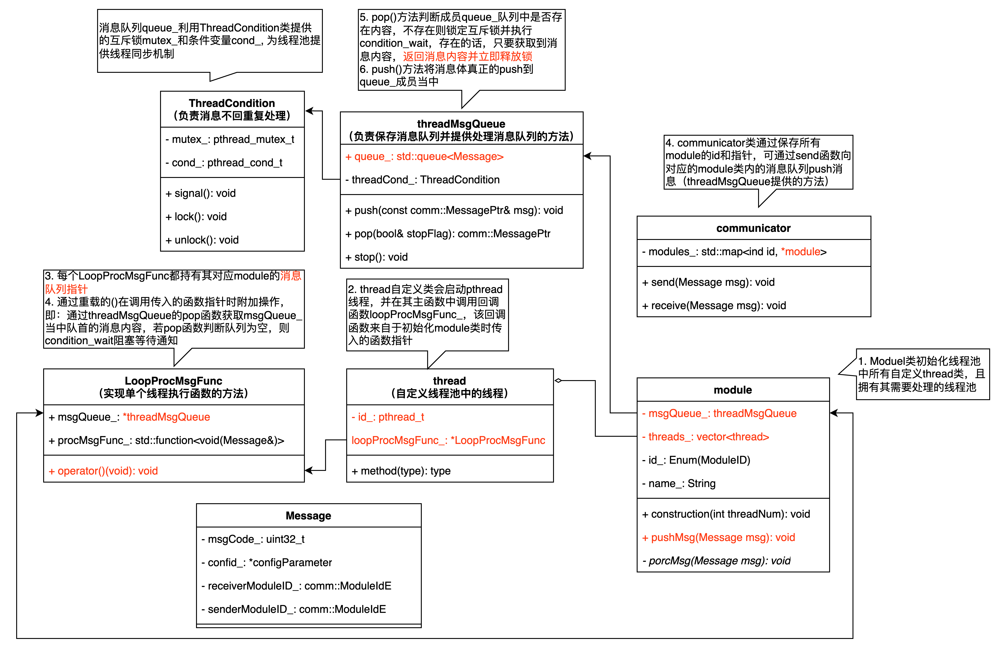
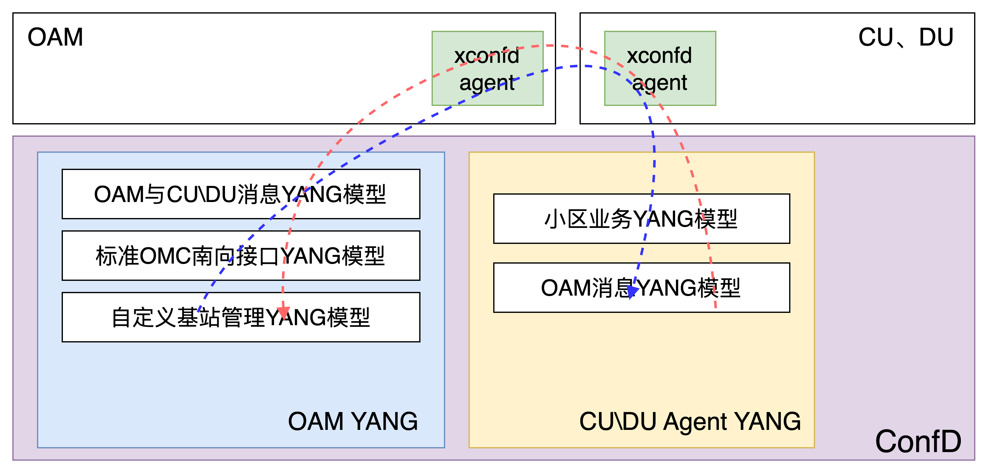
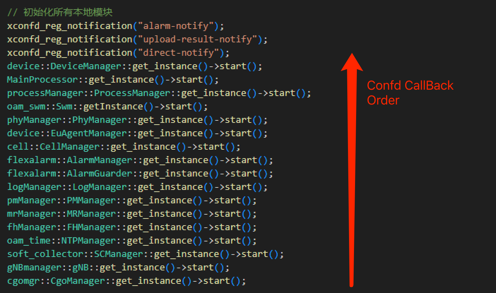

# 扩展型皮基站NR-OAM主进程总体设计实现说明

## Change Log
| Date (YYYY-MM-DD) | Version | Changed By   | Change Description                  |
| ----------------- | ------- | ------------ | ----------------------------------- |
| 2019-03-10        | 1.0.0   | 郭亮         | 创建初稿、新增告警、中心控制设计    |
| 2020-05-08        | 1.0.1   | 毕恒、刘金平 | 新增各类子模块                      |
| 2020-07-16        | 1.0.3   | 张铁明       | 新增PM性能管理                      |
| 2022-02-28        | 1.1     | 郭亮         | 设计方案补齐                        |
| 2024-07-01        | 2.0     | 郭亮         | 迁移至GitBook，并全部重新梳理、编写 |

## 1.总体结构与总体功能说明
在扩展型皮基站中，OAM是Operation and Management的简称，其主要功能可分为以下几大类：
- **基站设备的主要流程、配置与监控** 
包括且不限于基站启动流程、硬件监控、网口配置、进程管理、配置文件读取、脚本文件执行等
- **基站设备内部数据管理方法** 
OAM主要维护了基站内部所有用户可配置参数（配置参数当前由CONFD进程实现并管理），这些参数既可以由OAM管理并分发至协议层或可由协议层直接读取。
- **为OMC管理站提供完整的且符合标准的南向接口协议** 
OAM负责接收并转换从管理站发送过来的用户指令，并为这个指令提供对应的响应内容，在内部模型或方法与南向规范不一致时（或不同运营商存在差异）OAM需要提供必要的转换机制
- **为基站内部各个子系统提供统一南向接口对应的内部接口** 
包括且不限于OAM自身，5GNR系统下的CU\DU\PHY，LTE系统下的L2\L3等。OAM将南向接口下发的指令汇总并转发至各个业务模块或可以反向接收各个业务模块并上报至南向接口
- **远端设备（EU、RRU、加速卡）的通信和管理** 
针对EU、RRU而言，实现netconf协议进行管理。针对加速卡而言，使用内部自定义zmq-rpc进行管理

### 1.1.OAM系统对外上下文定义
由于NR-OAM进程负责了大部分设备级逻辑实现，故以NR-OAM进程为视角观察整个系统，OAM其中一个主要功能是在基站的整个生命周期内，对基站的其他各个子系统进行维护与管理的工作，所以熟知OAM具体要和那些物理或逻辑层面的模块交互是最为基础的知识。下图简要描述了OAM和其他各个子系统的逻辑或物理上下文关系：

 图1.1 OAM系统对外上下文定义

#### 1.1.1 业务子系统的简要介绍
- **CU**: 我司通过购买Radisys协议栈后，进行的二次开发。**由上海团队负责开发**
- **DU**: 我司通过购买Radisys协议栈后，进行的二次开发。
    - 数据包的调度和转发**由上海团队负责开发**
    - 实时的物理层处理**由北京团队负责开发**
- **PHY**: 在x86芯片上，对英特尔的FlexRan进行的二次开发,**由北京物理层团队负责开发**。(ARM等低成本或国产化平台有自己独立的物理层代码，目前暂未涉及)
- **NG_TRANS**: 回传链路通道（核心网、OMC等），在实际运行过程中，进程名称为：gnb_cu_ngtran。使用DPDK技术实现，在系统中可见名为veth_0的虚拟网卡，**由上海CUUP（Central Unit User Plane）组负责开发**
- **FH_TRANS**: 前传管理链路通道（EU、RRU），在实际运行过程中，进程名称为：om_trans。使用tun-tap技术实现实现，在系统中可见名为certus_tap0的虚拟网卡，**由北京物理层同事负责开发**（进程名om_trans中的om主要是因为该通道主要给OAM管理面使用，故此命名）
- **加速卡FH、FEC**: FH或FEC均为物理层层面上的概念，OAM在FH或FEC芯片上均驻留有agent程序，x86部分的oam进程通过agent与加速卡中FPGA进行交互
    - 卡中oam_agent**由我们OAM组负责开发**
    - 卡中驱动、FPGA分别由**北京对应团队负责开发**
- **海能达LTE**: 我司购买海能达L3+OAM的全套源码以实现LTE协议栈功能
    - OAM: **由我们OAM组负责开发和维护工作**
    - L3: **由上海CU组负责开发和维护工作**
    - L2,物理层（LBP加速卡）: **由海能达负责维护与开发工作**
- **自研LTE**: 我司购买第三方Aricent开发的LTE协议栈进行二次开发以实现自研LTE协议栈功能，其中与海能达L2以及物理层使用LBP卡资源不同，自研LTE中L2、物理层均使用CPU资源以及自研加速卡进行运算
    - OAM: **由我们OAM组负责开发和维护工作**
    - L3,L2: **由南京对应的组负责开发和维护工作**
    - 物理层（自研加速卡FH、FEC）: **由北京物理层、FPGA负责开发和维护工作**

### 1.2 OAM系统对内上下文定义
下图完整描述了OAM内部全部逻辑模块及其对应的配置文件、依赖库、脚本文件等，以及这些模块之间的简要关系。在该图中除了蓝灰色三个so文件外，其他模块均有源码且需要OAM组进行维护与开发工作（自研LTE用另外的文章说明）

 图1.2 OAM系统对内上下文定义

1.2章节将重点介绍消息队列、对外消息接口、CONFD数据库以及模块或进程间关系等这样较高级别概念，业务模块中的详细处理流程将在随后章节中详细介绍

#### 1.2.1 OAM内部线程池消息队列系统
NR-OAM内部提供一个模块基类+线程池+消息队列机制，所有业务模块均继承自基类module，继承后可以实现多线程并发处理网管或外部消息。
以下为该机制类图：

 图1.3 OAM内部模块基类，线程池和消息分发

**重点关注：** 
1. Thread类位于exec命名空间中，为自定义线程池当中的单个线程的实现，而不是三方依赖库提供的，具体可见类图内说明
2. communicator类就是发消息的时候最常用的类
3. 所有模块间消息均需要继承message类中，有一个名为configParameter作为基类，整个线程池消息系统负责传递该指针至目标模块，该消息理论可以是任意复杂的类型定义

#### 1.2.2 外部消息通信方式
从图1.2中可以粗略看出，NR-OAM对外消息接口可分为设备消息，网管消息和进程间消息，本小节将重点讨论设备消息和进程间消息，网管消息由于设计南向接口，篇幅较大，使用独立章节进行介绍
##### 1.2.2.1 进程间消息---IPC
基于Linux提供的IPC机制是当前OAM使用最为普遍的对外通信机制，主要用于和CU、DU、守护进程、海能达LTE-OAM等进行消息交互使用，下表展示了不同消息通道（message key）列表及其用途

| 宏定义                  | 值       | 说明                                                                                   |
| ----------------------- | -------- | -------------------------------------------------------------------------------------- |
| `OAM_MSGGET_KEY`        | `0xFF50` | 所有常规非业务敏感的消息均通过该通道进行发送，通常来讲是OAM内部使用                    |
| `OAM_ALARM_KEY`         | `0xFF51` | 用于接收CU、DU、PHY给OAM的告警信息                                                     |
| `OAM_PM_KEY`            | `0xFF52` | 用于同CU、DU交互性能配置数据和性能统计Counter具体数值                                  |
| `OAM_CU_SC_KEY`         | `0xFF53` | 用于同CU交互信令软采配置和内容数据（信令软采仅实现了1、2条信令上报，是一个Demo级功能） |
| `OAM_CU_ENERGYSAVE_KEY` | `0xFF54` | 用于同CU交互基站节能功能开启后的数据交互、节能开启以及节能功能过程中的唤醒通知等       |
| `OAM_MR_KEY`            | `0xFF55` | 用于同CU、DU交互测量上报的配置数据和具体数据内容                                       |
| `GNB_5G_ANR_KEY`        | `0xFF56` | 用于接收CU发来的ANR配置数据，该数据当前在告警模块代为处理                              |
| `OAM_PHYDRV_KEY`        | `0xFF57` | 预留的与物理层进程交互的消息通道，暂未启用                                             |
| `OAM_GNB_KEY`           | `0xFF58` | 专用于海能达LTE自动开站通知结果                                                        |

重点关注代码文件：common > out_message > out_message_opcode.h

##### 1.2.2.2 进程间消息---CONFD
该机制借用了confd配置数据回调机制实现了消息机制中的pub\sub机制。

 图1.4 使用CONFD进行进程间消息通信

**使用场景：** 
- 同时向CU、DU发送消息，且CU、DU预留了对应的MO模型，如小区激活（该机制目前OAM有这样的流程，但暂未实现且并未被调用）
- 处理内部MO和南向模型不匹配的情况，在项目初期，由于CU、DU所设计的模型和运营商发布的模型结构相差较大，所以OAM和CU、DU使用反写CU、DU配置数据的方式同CU、DU进行交互，OAM为pub方，CU、DU为sub方。当前仍然遗留的不匹配模型可见xconfd_agent_cellmgr.cpp当中的son处理部分。或者项目初期大量的匹配机制，可见xconfd_agent_tr069map.cpp的历史版本

##### 1.2.2.3 进程间消息---MML
与confd消息类似，只不过该消息机制只适用于海能达LTE与NR-OAM之间的交互，且当前在NR-OAM上的应用仅限于通过硬编码MML命令的方式，并且通过获取并解析返回的json报文来主动向海能达系统查询以下三项信息：
- 小区列表及其对应详细信息
- 扇区列表及其对应详细信息
- 小区激活状态

虽然当前仅应用了部分内容的查询功能，但该功能可以扩展到增删改查四个方面，到目前为止，南向接口对海能达系统的配置仍然不够完善，由于海能达系统的配置模型设计不可能再进行改动，如果有机会且必须适配南向接口的话，仍然可能需要借助该途径来实现对应的功能。

代码实现路径：common > lte_mml_message > src > mml_communicate.cpp

#### 1.2.3 CONFD简要说明
ConfD 是由思科（Cisco）开发的一款强大的网络配置和管理工具，广泛应用于电信和网络设备行业。它提供了基于 NETCONF 和 YANG 模型的高级配置管理能力。其内置的数据库系统，负责存储和管理设备的配置信息

##### 数据库结构
ConfD 使用层次结构的数据库来管理配置和状态数据。数据库由以下几个关键部分组成： 
- **初始化数据（xml）**：用于在没有运行配置数据文件的时候，生成设备初始化数据
- **运行配置数据存储(cdb)**：用于保存设备的配置数据。配置数据通常通过 NETCONF 协议进行访问和修改。
- **候选配置(candidate.db)**：ConfD 支持候选配置（Candidate Configuration），允许用户在实际应用之前对配置进行验证和调整。

##### MO注册与回调机制
CONFD数据库中的MO（Model Object）可以理解为数据库中的表，有yang语言负责构建，而回调函数可以理解为数据库中的触发器，当MO发生改变时，相应的回调函数将被触发。 
在各个模块注册对应MO的回调函数后，当进程首次启动以及MO发生改变时（首次启动也被视作MO变化），首次启动时回调函数会被xconfd框架依次调用，顺序是倒序的，如下图所示：

 图1.5 CONFD的回调函数顺序
