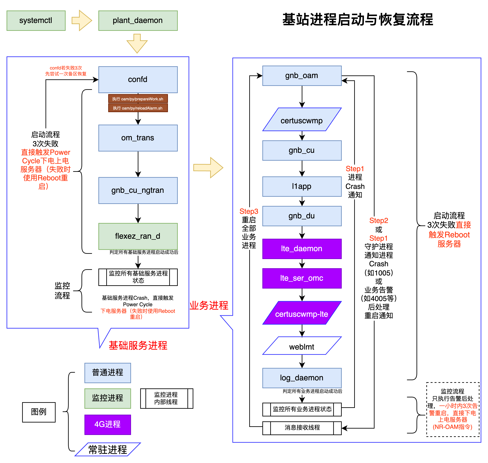
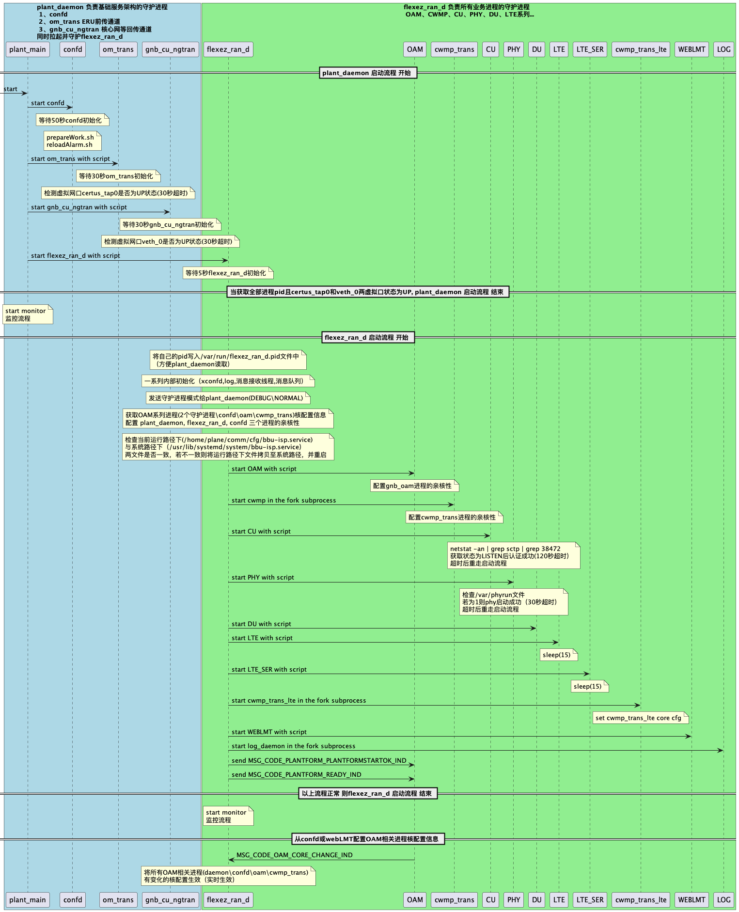
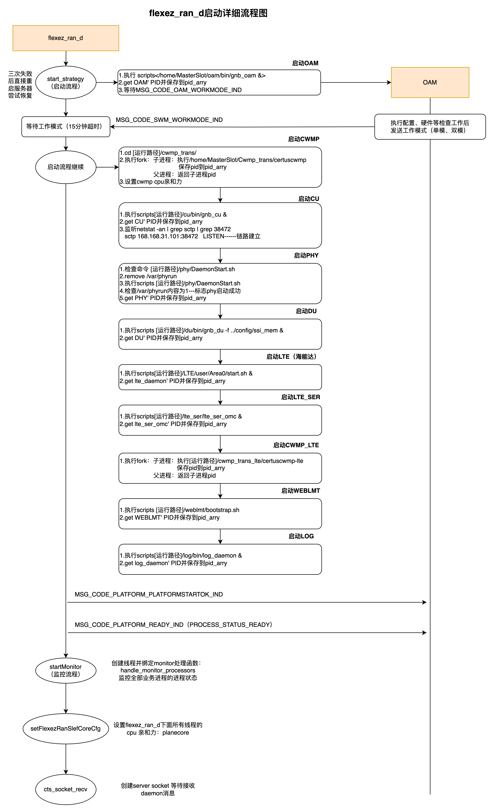
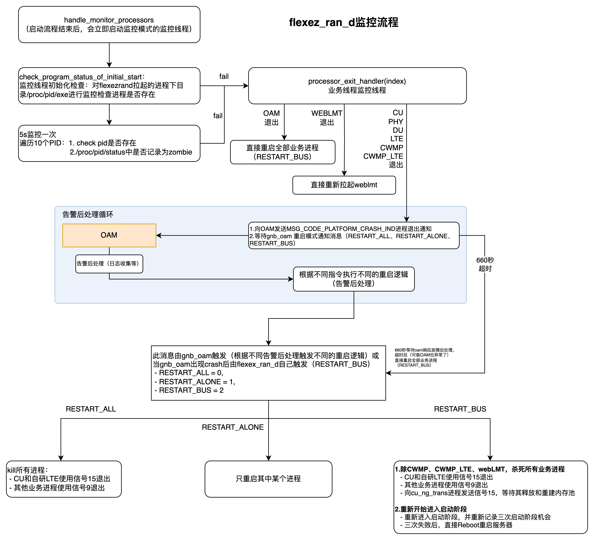
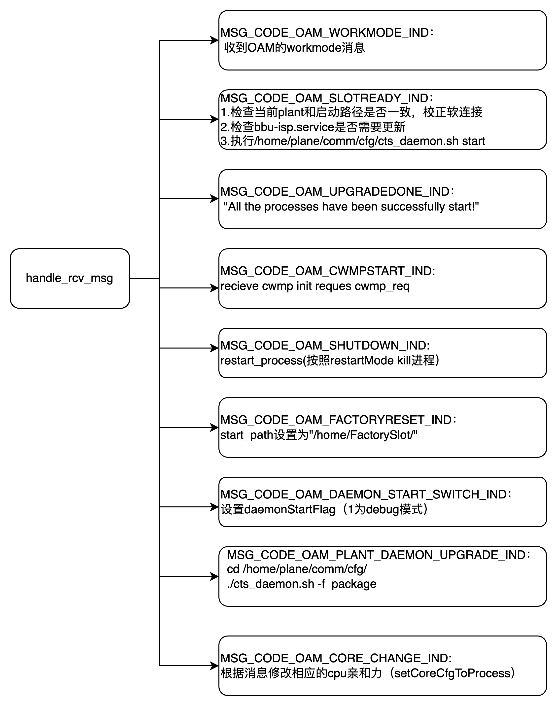

# 守护进程


## 1. 维护基站系统的三个守护进程
### 1.1 systemctl（systemd）
是一个操作系统管理守护进程，用于启动和管理 Linux 系统上的服务、进程和相关资源。用于执行基站业务进程组的开机启动、后台启动与plant_daemon的监控，当plant_daemon守护进程出现异常时，将其重新拉起
- 在运行的基站中，配置文件路径为：/usr/lib/systemd/system/bbu-isp.service
- 在代码库中的位置为：bbu-isp: comm > cfg > bbu-isp.service
- 当前文件内容为：<br>

```
[Unit]
Description=BBU ISP
After=multi-user.target

[Service]
ExecStart=/home/plane/plant_daemon
KillMode=process
KillSignal=SIGTERM
EnvironmentFile=-/etc/sysconfig/bbu-isp
LimitCORE=0
StandardOutput=null
Restart=on-failure

[Install]
WantedBy=multi-user.target
```

### 1.2 plant_daemon
用于监控基站基础服务进程的守护进程
- confd：基站配置管理 和 数据库
- om_trans：基站前传链路（通往EU、RRU）基础服务
- gnb_cu_ngtran：基站回传链路（通往核心网等）基础服务
- 无线业务进程守护进程（flexez_ran_d）
- 当出现某些异常后，可能自主触发对应的恢复流程，具体可见后图
- 执行预留在基站内部的名为prepareWork.sh的脚本，**该脚本可供不限于项目经理、测试、运维人员编辑，提供一些灵活的可扩展性**

### 1.3 flexez_ran_d
- 用于监控基站全部业务进程的守护进程
- 业务进程区分常驻进程和普通业务进程
- 用于接收gnb_oam发送的告警后处理请求，并执行对应的重启策略
- 当出现某些异常时，可能自处触发对应的恢复流程，具体可见后图
注：由于外场稳定运行以及使用经验总结，主线版本取消各类失败后的切换备份槽位的动作，改为各类情况的重启基站


以上内容详见下图：

<br>图1.1 三个守护进程的关系及其主要流程

- 常驻进程：
    - 业务进程有告警后处理需要重启全部业务进程的情况发生时常驻进程不退出
- CONFD自恢复：
    - 当启动阶段confd启动失败时，会额外多一次软重启，尝试从备区恢复数据后再次启动，若再次失败才执行基站下电上电或Reboot的恢复机制
    - 运行过程中confd异常退出，与其他基础进程一样，直接上电下电或Reboot恢复
- 告警后处理：
    - 告警后处理永远不会触发守护进程中Reboot服务器的流程
    - Step1,2,3流程为常规的故障后处理恢复流程，后处理只会遵循之前和业务进程开发组协商好的告警后处理机制进行
    - 一个小时内触发三次**带有重启后处理的告警**，会自动通过Shell掉电服务器或reboot服务器（通过Shell掉点服务器失败时）

#### 一个小时内三次告警触发掉电的告警列表
| 键值  | 中文描述                   |
|-------|----------------------------|
| 1002  | 协议栈软件启动失败         |
| 1003  | CU软件崩溃                 |
| 1004  | DU软件崩溃                 |
| 1005  | 物理层软件崩溃             |
| 1006  | CWMP_Trans软件崩溃         |
| 1007  | CWMP_Trans_Lte软件崩溃     |
| 1008  | LTE软件崩溃                |
| 1029  | 前传卡不在位告警（不等3次，直接掉电恢复） |
| 1030  | GPS超时未锁定（不等3次，直接掉电恢复） |
| 1031  | 基站启动初始化失败（不等3次，直接掉电恢复）  |
| 3004  | 小区失效告警               |
| 4001  | PHY上行任务生成失败        |
| 4002  | PHY下行链路执行未完成      |
| 4003  | PHY前传异常停止            |
| 4004  | PHY下行帧号不匹配          |
| 4005  | PHY API超时                |
| 4006  | PHY上行帧号不匹配          |
| 4007  | PHY上行链路执行未完成      |


## 2  plant_daemon + flexez_ran_d 启动各个脚本进程顺序、方式
（含oam系列进程CPU亲核性改变时机）

<br>图1.2 守护进程启动顺序


## 3 flexez_ran_d详细说明
### 3.1 flexez_ran_d启动阶段详细说明

<br>图1.3 flexez_ran_d启动阶段详细说明

### 3.2  flexez_ran_d 监控流程详细说明以及三种重启模式

<br>图1.4 flexez_ran_d 监控流程详细说明以及三种重启模式

### 3.3  flexez_ran_d 消息处理能力（From OAM）

<br>图1.5 flexez_ran_d消息处理能力


# Change Log
|  Date (YYYY-MM-DD) |  Version | Changed By  |  Change Description |
|---|---|---|---|
| 2024-07-04  | 1.0  | Guoliang  |  从Confluence转移至GitBook并添加一些内容 |

