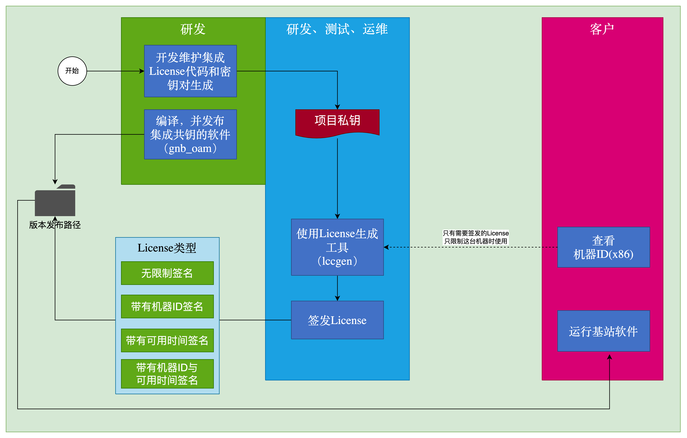
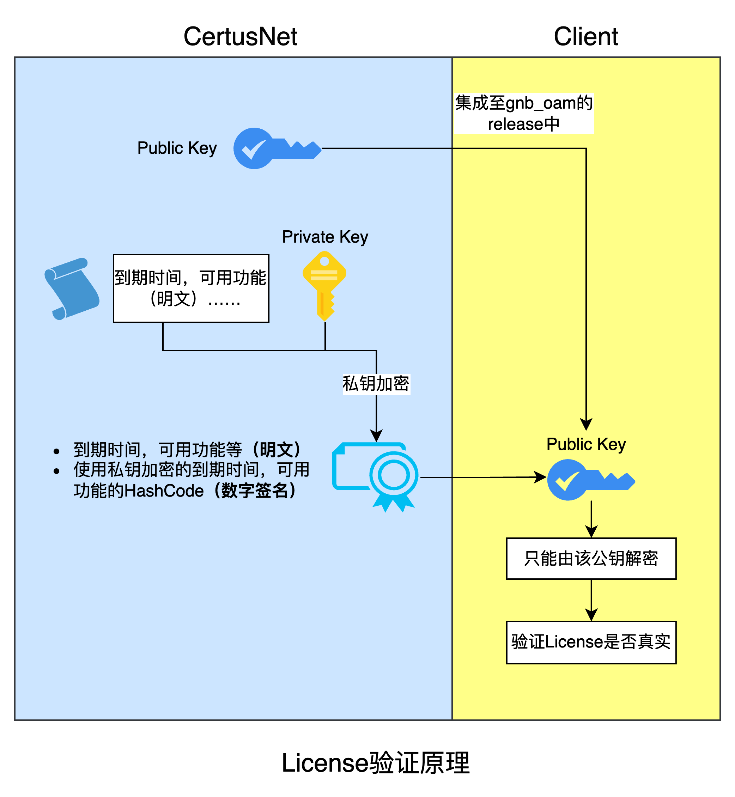
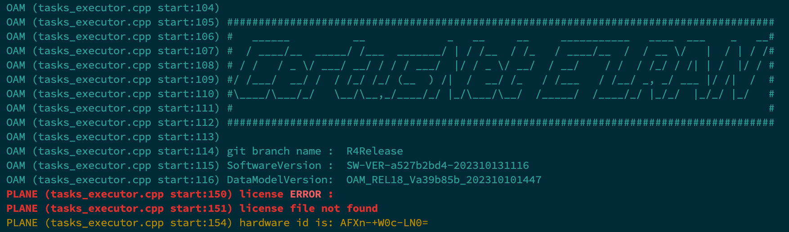

# 基站License简单原理与工作流
基站在运行阶段，NR-OAM进程（即gnb_oam）会自动加载保存在整包当中的license文件，并校验该licnese是否合法

## 发布license的工作流程


注：
- 当前赛特斯扩展型皮基站产品线的私钥被保存在了License项目库当中，也就是说目前该私钥暂时由oam组进行维护
- 按上图规划，该私钥其实应该由项目或运维部门进行保管，但目前由于还没有license的应用场景，故暂时由oam研发部门保管
- 私钥文件以及可供签发license的bin文件被放在：
  - 代码库：172.21.27.166/oam_du/flexez_license
  - 私钥路径：projects > FlexEzRAN > private_key.rsa（理论上为公司重要资产，需要妥善保管）
  - bin文件路径：projects > FlexEzRAN > lccgen
- 公钥头文件和license被集成在了gnb_oam程序中
  - 路径：third_party > license > inc > licensecc > public_key.h
  - license文件：oam/bin文件夹下的gnb_oam的同名文件，gnb_oam.lic。当前的license为超级签名，即没有任何限制的license。为内部使用方便，同样需要妥善保存


## 签发基站License
将生成好的lccgen放入Project文件夹下对应的项目中（目前已经前提是生成好了密钥对和bin文件，上段已提及，再次强调），具体如下：
- 代码库：172.21.27.166/oam_du/flexez_license
- 私钥路径：projects > FlexEzRAN > private_key.rsa （理论上为公司重要资产，需要妥善保管）
- bin文件路径：projects > FlexEzRAN > lccgen


签发命令如下：

```shell
./lccgen license issue --client-signature AABS-VAD4-1Tw= -o license/1.lic
./lccgen license issue --valid-from 2021-12-16 --valid-to 2021-12-17 --client-signature AEpQ-aZSt-XAs= -o license/ForZhaog-StartDate-ValidDate-Machine.lic
```

- 实现函数：issueLicense()->write_license()->signString() 


## RSA公钥、私钥对生成
如果有新的项目需要集成License功能，需要生成新的密钥对，具体操作如下：

- cmake命令指定项目名称：

```shell
# try是项目名称
cmake .. -DCMAKE_INSTALL_PREFIX=../install -DLCC_PROJECT_NAME=try 
```

- make之后生成公钥和私钥，即make后通过bin,执行以下命令

```shell
lccgen project initialize -t "${PROJECT_SOURCE_DIR}/src/templates" -n "${LCC_PROJECT_NAME}" -p "${LCC_PROJECTS_BASE_DIR}"
#例如：./lccgen project initialize -t /home/workspace/learn/licensecc/src/templates -n try -p /home/workspace/learn/licensecc/projects
```

生成密钥对函数（generateKeyPair）
- 使用EVP系列函数，这些函数提供了对底层加解密函数的封装 EVP_PKEY_keygen_init -> EVP_PKEY_keygen

## 基站License文件的格式和基础原理


基站License系统使用 RSA 和 SHA256 算法对 License 文件进行签名和验证



私钥签名，公钥验证：私钥对数据的哈希值进行加密生成签名，公钥用于解密签名并验证数据的完整性和来源


以下是对图片内容及流程的详细解析：
- **Public Key 和 Private Key**
  - **Public Key (公钥)**：用于验证签名的合法性
  - **Private Key (私钥)**：用于生成签名
  - **RSA**：使用 RSA 算法的共钥私钥对
  - **SHA256**：表示在生成签名过程中，先对 License 文件的内容进行 SHA256 哈希处理（不可逆）

- **使用限制明文**
  - 表示 License 文件中包含的一些明文签名，页即使用限制条款，实例如下：

```ini
[FLEXEZRAN]
lic_ver = 200
client-signature = AFXn-+W0c-LN0=
valid-from = 2021-12-16
valid-to = 2021-12-17
```

- 给一台名为“AFXn-+W0c-LN0=”的机器签发一个使用期限为一天的License签名
- AFXn-+W0c-LN0=来自于没有License的基站设备首次运行的gnb_oam日志或控制台打印



### 流程和原理解释

1. **生成签名的过程**：
   - 生成 License 文件，包括一些使用限制的明文信息。
   - 使用 SHA256 对 License 文件的内容进行哈希计算，得到一个固定长度的哈希值。
   - 使用 RSA 算法的私钥对该哈希值进行加密，生成签名。
   - 将签名附加到 License 文件中，生成最终发布的 License 文件。

2. **验证签名的过程**：
   - 从发布的 License 文件中提取出签名和 License 文件的内容。
   - 使用 SHA256 对 License 文件的内容(即使用限制明文)进行哈希计算，得到哈希值。
   - 使用 RSA 算法生成的公钥对签名（即license中加密过的哈希值）进行解密，得到解密后的哈希值。
   - 比较两者的哈希值是否一致。如果一致，证明 License 文件没有被篡改，签名合法。


# Change Log
|  Date (YYYY-MM-DD) |  Version | Changed By  |  Change Description |
|---|---|---|---|
| 2024-07-23  | 1.0  | Guoliang  |  创建文档并完成基本内容 |
