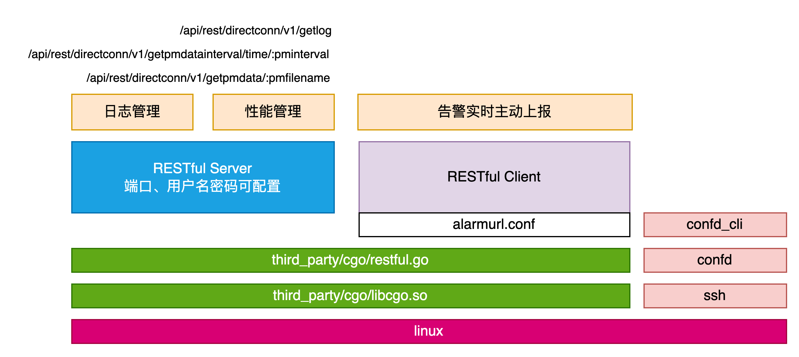
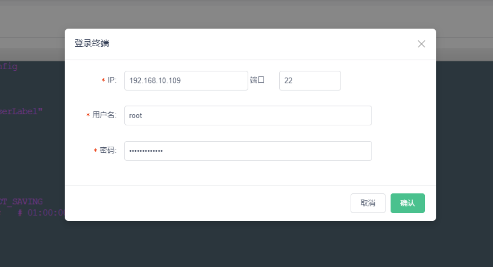
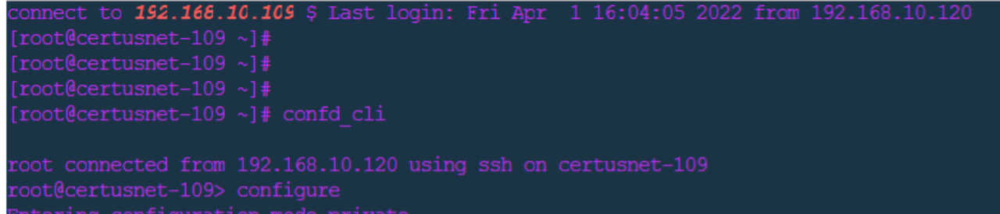
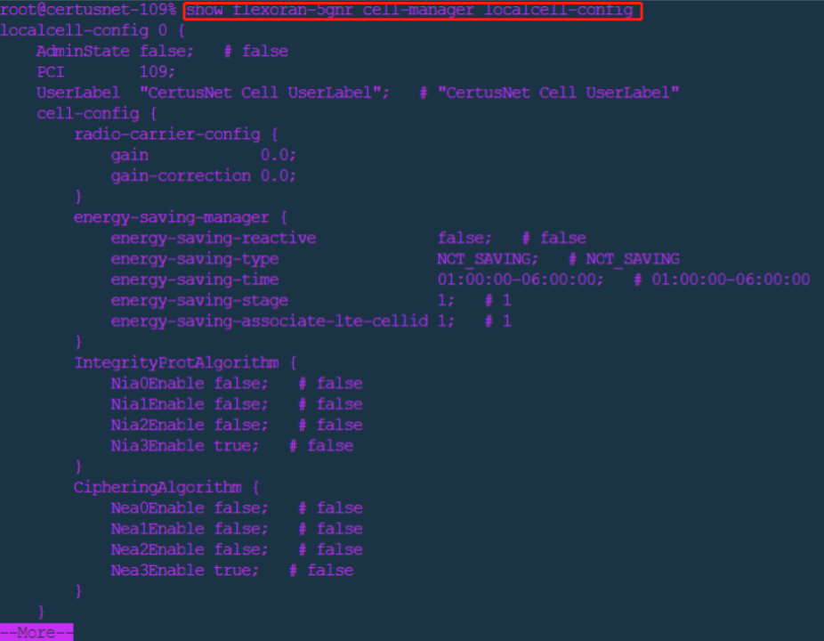
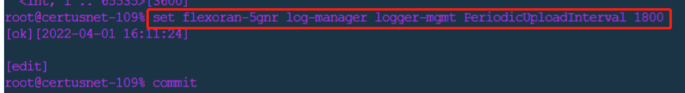
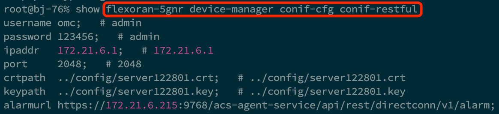
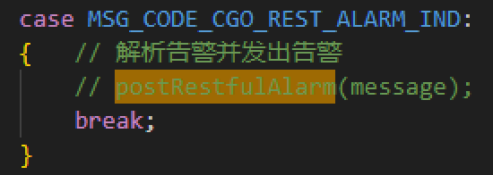

# 网元直连接口功能
根据中国移动的管理需求，网元直连接口被定义用来将NMS直连至被管网元，不需要OMC或网管接口机等中间环节，而实现NMS对被管网元的直接操作。

主要涉及文件：
- modules > cgo_manager > src > cgo_manager.cpp
- third_party > cgo > restful.go
- common > confd_message > src > xconfd_agent_rest.cpp


### 主要功能列表和简要说明

|  功能 |  描述 |
|---|---|
| 配置管理 |  使用现成的confd+Linux的ssh登陆方式即可满足需求  |
| 故障管理（告警） |  采用RESTful的方式进行告警上报，具体由Go语言实现  |
| 日志管理 |  采用RESTful的方式进行日志获取，具体由Go语言实现  |
| 性能管理 |  采用RESTful的方式进行性能文件获取，具体由Go语言实现  |
| 安全认证 |  采用HTTPS+TLS方式实现  |

主要实现功能以及对应的结构关系如下：



## 配置管理（SSH+CONFD）
运营商要求系统应具备灵活获取和设置网元配置数据的能力，支持直连接口和命令行操作，同时满足《移动通信网网络管理接口技术规范—OMC北向接口安全管理接口功能需求》等规范的配置和安全管理要求，确保全面的操作维护功能。所以基站侧采用SSH登录终端后，然后通过命令行（即confd_cli）的方式已同时满足安全和增删改查的基站数据配置的需求







## RESTful接口
### RESTful配置项



### RESTful Server


### 性能
由NMS通过RESTful下发性能文件获取请求，在下发请求之前，需要通过MML命令行的方式，去基站当中查询基站当前已保存的所有性能文件列表。请求中包含需要基站上传的文件名，然后基站会通过RESTful文件流的方式向NMS上传性能统计文件。

NMS(RESTful client)  -->  NE(RESTful server)


请求性能数据URI（自定义）:
```ini
/api/rest/directconn/v1/getpmdata
```


性能数据请求报文示例（自定义）：
```ini
POST /api/rest/directconn/v1/getpmdata HTTP/1.1
Host: serverIP:port
Content-Type: application/json; charset=UTF-8
Content-Length:…
{
    "pmfilename": "A_NR_20220401.1550+0800-1555+0800_00461A.221294291.xml"
}
```


性能文件上传报文示例（自定义）:
```ini
POST /api/rest/autoConfig/v1/planFile/{jobId}
Host: serverIP:port
accessToken: 52661fbd-6b84-4fc2-aa1e-17879a5c6c9b
Content-Type: multipart/form-data; charset=UTF-8
Content-Length:…

 文件流...
```

#### 代码入口
可参见restfulInit函数（即上图中的RESTful Server）中,由以下两个HTTP请求路由器以及对应的回调函数实现
```golang
router.POST("/api/rest/directconn/v1/getpmdata/:pmfilename", postpmfiles)   // pm
router.POST("/api/rest/directconn/v1/getpmdatainterval/time/:pminterval", postpminterval)  // pm-interval
```


### 日志
由NMS通过RESTful下发日志文件获取请求，请求当前基站日志，然后基站会通过RESTful文件流的方式向NMS上传日志文件tar包。

NMS(RESTful client)  -->  NE(RESTful server)


请求日志URI（自定义）:
```ini
/api/rest/directconn/v1/getlog
```

日志文件请求报文示例（自定义）：
```ini
POST /api/rest/directconn/v1/getpmdata HTTP/1.1
Host: serverIP:port
Content-Type: application/json; charset=UTF-8
Content-Length:…
{
}
```


日志文件上传报文示例（自定义）:
```ini
POST /api/rest/autoConfig/v1/planFile/{jobId}
Host: serverIP:port
Content-Type: multipart/form-data; charset=UTF-8
Content-Length:…

  文件流...
```


#### 代码入口
可参见restfulInit函数（即上图中的RESTful Server）中,由以下两个HTTP请求路由器以及对应的回调函数实现
```golang
router.POST("/api/rest/directconn/v1/getlog", postlogfiles)   // log
```

### 告警
采用RESTful的方式进行告警上报，基站向NMS主动上报基于Json RESTful的告警报文，此时基站是RESTful的client，而NMS为RESTful的server。

NE(RESTful client)  -->  NMS(RESTful server):


主动上报告警URI（自定义）：
```ini
/api/rest/directconn/v1/alarm
```

告警报文示例（自定义）：
```ini
POST /api/rest/directconn/v1/alarm HTTP/1.1
Host: serverIP:port
Content-Type: application/json;charset=UTF-8
Content-Length:…
{
    "ObjectID": "220657951-NR", 
    "EventTime": "test", 
    "AlarmCode": "2022-04-01 11:14:59",
    "AlarmType": "EquipmentAlarm",
    "PerceivedSeverity": "Critical",
    "AlarmStatus": "1",
    "SpecificProblem": "Start timeout and NOT collect the full ready messages",
    "AdditionalText": "The Phy CU DU OAM process maby carsh or block w",
    "AlarmSource": "DN='DC=BJ,SubNetwork=1,ManagedElement=220657951,Type=gNB|PROC_MGR"
}
```

#### 代码入口：
当告警产生后，会主动向外发送RESTful格式的告警（由于基站直连接口为应标功能，故当前处理被注释，如后图）
- void CgoManager::postRestfulAlarm(const comm::MessagePtr& message)




# Change Log
|  Date (YYYY-MM-DD) |  Version | Changed By  |  Change Description |
|---|---|---|---|
| 2024-07-24  | 1.0  | Guoliang  |  创建文档并完成基本内容 |
