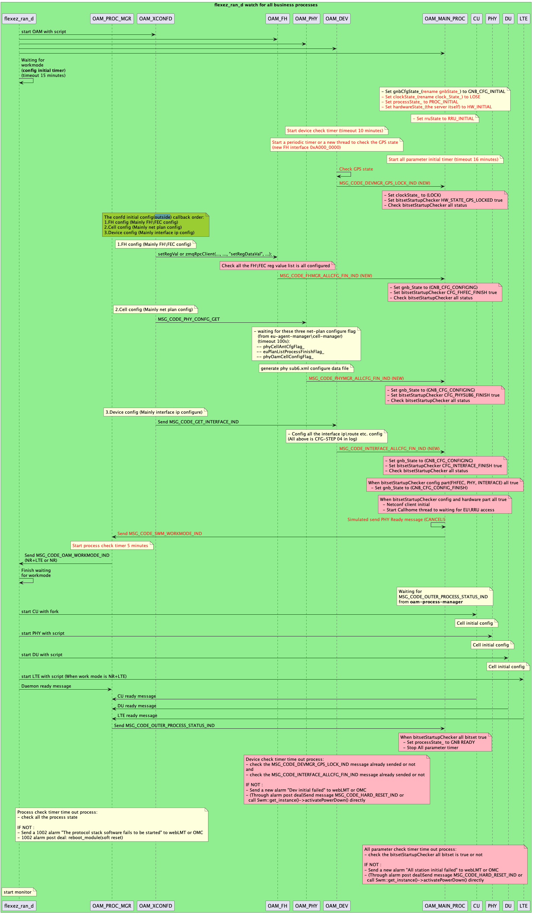

# 设备启动流程
主要涉及模块文件：
- OAM_XCONFD（配置管理模块）
    - 代码位置：common > confd_message > src > xconfd_agent_xxx.cpp
- OAM_FH（前传卡管理模块）
    - 代码位置：modules > fh_manager > src > fh_manager.cpp
- OAM_PHY（物理层管理模块）
    - 代码位置：modules > phy_manager > src > phy_manager.cpp
- OAM_DEV（设备管理模块）
    - 代码位置：modules > device_manager > src > device_manager.cpp
- OAM_MAIN_PROC（主流程管理模块）
    - **主流程进行初始化设置，包括设定各个状态，总体控制基站的全部启动流程**
    - 代码位置：executor > src > main_processor.cpp

## 1.1 主要流程

设备启动流程，按照当前的设计思路，有以下三个方面必须达成才能够认为设备启动流程完毕：
1. 设备状态（GPS）必须锁定
2. 配置（PHY、FH、Cell、DEV）必须全部完整且无误
3. 各个进程（CU、DU、PHY、LTE）必须全部READY

### 1.1.1 整体流程规范
1. 初始化配置流程规范：FH\FEC配置 → PHY(主要是网规参数) → INTERFACE传输参数，三者缺一不可
2. 初始化硬件检查流程规范：GPS状态（详见上边新增外部接口）、前传接口状态（certus_tap0）、回传接口状态（veth_0），三者缺一不可
3. 在对应的工作模式下，对应业务进程必须READY
上述1、2两个状态均处于准备就绪状态后，才能继续启动业务进程，收齐业务进程全部READY状态（PHY除外），才能视为基站初始化启动流程结束



### 1.1.1 各模块检查流程附加说明
- 设备检查
    - OAM_DEV启动设备检查（当前主要是GPS）10分钟定时器超时，10分钟内每1分钟检查一次，检查GPS状态锁定或超时后发送相应消息
    - 检查GPS状态后（10分钟超时或正确获取到锁定状态），发送MSG_CODE_DEVMGR_GPS_LOCK_IND消息，通知OAM_MAIN_PROC主流程GPS完成锁定或检查超时
- 配置检查
    - OAM_XCONFD按顺序回调FH(前传卡)、Cell（小区）、DEV（传输，设备）配置
    - 配置管理模块会将所有配置任务交由对应的管理模块处理（异步）
    - 每个配置模块完成后，发送相应消息通知OAM_MAIN_PROC
    - OAM_MAIN_PROC接收消息后，更新状态和检查各个配置状态
- 业务进程启动状态检查
    - 当以上2、3两个步骤完成后，OAM_MAIN_PROC向OAM_PROC_MGR发送工作模式设置（单模还是双模）消息。
    - 守护进程接收到工作模式后启动CU、PHY、DU、LTE模块，各自进行初始化配置
    - OAM_PROC_MGR启动工作模式检查定时器，若接收到各个业务进程初始化完成消息，则进入启动完成阶段，若未收到则上报1002告警并进行对应的告警后处理
- 启动完成检查
    - （接上一步流程）OAM_PROC_MGR向OAM_MAIN_PROC发送外部进程状态消息。
    - OAM_MAIN_PROC检查所有模块和硬件状态，设置GNB READY状态。

### 1.1.2 初始化流程中定时器汇总
- **设备检查定时器（10分钟）**
    - 主要用于检查GPS状态以及前传卡全部寄存器的配置状态，若超时则发送告警1030后触发服务器重启尝试恢复
    - 定时器名称：dev_control_timer_
    - 附属定时器（10分钟内，每60秒检查一次GPS状态）：gps_check_timer_
- **网络规划配置定时器（100秒）**
    - 若用户配置的网络规划参数（RouteIndexList等）不全则导致此定时器超时，sub6.xml将可能按照默认值启动造成一些业务问题
    - 代码位置：modules > phy_manager > src > phy_manager.cpp
    ```c++
    void PhyManager::create_phy_configuration_file(stru_PhyConfig PhyConfig)
    {
        uint32_t tmpCount = 0;
        // 等待小区规划信息RouteIndexList读取并分析完毕
        while (1)
        {
            if (cell::CellManager::get_instance()->phyCellAntCfgFlag_ &&
                device::EuAgentManager::get_instance()->euPlanListProcessFinishFlag_ &&
                phyOamCellConfigFlag_)
            {
                cts_log_external(INFO, "PHY_MANAGER", "RouteIndexList analysis finish!");
                break;
            }
            else
            {
                sleep(1);
                tmpCount++;
                if (tmpCount > 100)
                {
                    cts_log_external(ERROR, "PHY_MANAGER", "RouteIndexList analysis TIMEOUT!");
                    break;
                }
            }
        }

        // ..... 继续执行phy配置文件的生成工作
    }
    ```
- **进程状态检查定时器（5分钟）**
    - 当守护进程将CU、DU、PHY、LTE、OAM等业务进程启动后，启动该定时器，若超时则上报1002告警并进行对应的告警后处理
    - 定时器位置(命名空间+类)和名称：processManager::processManager::timer_mgr_
- **守护进程等待OAM响应定时器（15分钟）**
    - 该定时器通过OAM向守护进程发送工作模式之后，启动所有协议栈等业务进程的机制，检查所有流程（初始化配置、GPS设备状态、业务进程状态）是否执行完成，若超时则上报对应初始化失败流程，并触发设备重启以尝试恢复基站
    - 代码位置（守护进程，非OAM）：isp > src > bbu_isp.cpp > starter_process(unsigned char *, bool)
    ```c
    // wait for work_mode msg
    if (index == MODULE_ID_OAM && !busmode)
    {
        cts_log_external(INFO, "Fexez_ran_d", "Waiting for the OAM to be initialized!");
        int i = 0;
        while (1)
        {
            /*[Bug#7008]waiting for work_mode from 120s to 15m*/
            if (work_mode >= 0 || i > 60*15)
            {
                break;
            }
            i++;
            sleep(1);
        }
        /*[Bug#7008]waiting for work_mode from 120s to 15m*/
        if (i > 60*15)
        {
            cts_log_external(ERROR, "Fexez_ran_d", "oam start timeout(15m)!");
            return -1;
        }
    }
    ```
- **全流程检查定时器（16分钟）**
    - 该定时器用于检查全部流程是否已经完成，若超时则上报1031号告警并触发基站重启
    - 定时器名称：initial_timer_

## 1.2 优化内容详细说明

### 1.2.1 DEV模块

1. 新增设备管理专用初始化单次定时器（10分钟），用于检查GPS状态，如果超时则上报对应告警（新增）并触发整站重启
    a. 新增专用线程或周期定时器（1分钟），用于检查GPS锁定状态，待获取到的状态OK，通过消息通知MAIN_PROC模块并停止线程或周期定时器；
2. 当所有INTERFACE的IP地址、路由信息等配置完成后，通过新增消息告知MAIN_PROC传输消息配置完成

### 1.2.2 FH_MGR模块

1. 在OAM_FH当中增加一个bitset类型，专门用于记录FH\FEC是否已经配置完成
2. 当FH、FEC全部配置完成后，OAM_FH与OAM_MAIN_PROC模块新增消息，以便通知配置结果

### 1.2.3 MAIN_PROC模块

1. MAIN_PROC中新增std::bitset类型成员变量bitsetStartupChecker_，用于把控基站启动的全部需检查项
2. 通过bitsetStartupChecker_当中bit位的各种不同变化，操控基站行为：
    - 当所有CFG_XXX的bit位为true时将成员gnbCfgState_设为GNB_CFG_CONFIG_FINISH
    - 当所有CFG_XXX和HW_XXX的bit位为true时
        - 将对应的两成员clockState_和hardwareState_设为完成
        - 开启Callhome进程让EU、RRU可接入
    - 当全部bit位为true时
        - 完成基站初始化启动流程


新增成员bitsetStartupChecker_：
```c++
// 新增基站启动检查项
typedef enum enumBbuStartupState {
    CFG_FHFEC_FINISH = 0,
    CFG_PHYSUB6_FINISH,
    CFG_INTERFACE_FINISH,
    HW_STATE_GPS_LOCKED,
    HW_STATE_OUTER_INTERFACE_READY, // 默认设为true
    SW_STATE_PROCESS_READY,
    ALL_STARTUP_CHECK_NUM
} enumBbuStartupState;
 
// 新增MainProcessor私有成员函数
private:
std::bitset<ALL_STARTUP_CHECK_NUM> bitsetStartupChecker_;
```


新增OPCODE对应的消息体：
```c++
/* 如下三个消息宏共用同一个配置完成通知消息
 * MSG_CODE_PHYMGR_ALLCFG_FIN_IND
 * MSG_CODE_INTERFACE_ALLCFG_FIN_IND
 * MSG_CODE_FHMGR_ALLCFG_FIN_IND
 */
class starting_device_config_result_ind : public comm::configParameter
{
public:
    bool configResult;
    bool timeOutFlag;
 
    starting_device_config_result_ind()
        : configResult(false), timeOutFlag(false) {}
    ~starting_device_config_result_ind() {}
};
 
/* MSG_CODE_DEVMGR_GPS_LOCK_IND */
class starting_device_gps_check_result_ind : public comm::configParameter
{
public:
    bool lockState;          // 指示启动阶段GPS状态是否已经所动
    bool timeOutFlag;        // 指明是否已经进入GPS状态获取超时
    std::string faildReason; // 说明GPS状态未锁定原因，当lockState为true时，空着即可
 
   starting_device_gps_check_result_ind()
        : lockState(false), timeOutFlag(false), faildReason("") {}
    ~starting_device_gps_check_result_ind(){};
};
```


## 2.1 外部接口

### 2.1.1 (FH获取GPS状态)

| 基地址      | 偏移   | 权限 | 默认值 | 属性  | 说明                                   |
|-------------|--------|------|--------|-------|----------------------------------------|
| 0xA000_0000 | 0x04C  | R    |        | other | bit0：5383失锁指示。高有效              |
|             |        |      |        |       | bit4：GPS失锁指示。高有效               |
|             |        |      |        |       | bit8：GPS模块失锁指示。高有效           |
|             |        |      |        |       | bit12：CPRI3失锁指示。高有效            |
|             |        |      |        |       | bit16：CPRI2失锁指示。高有效            |
|             |        |      |        |       | bit20：CPRI1失锁指示。高有效            |
|             |        |      |        |       | bit24：CPRI0失锁指示。高有效            |
|             |        |      |        |       | bit31:28：N/A                           |

### 2.1.2 (FH，FEC全部需配置的寄存器列表)

| 基地址      | 偏移    | 权限 | 默认值  | 属性   | 说明                                                                                  |
|-------------|---------|------|---------|--------|---------------------------------------------------------------------------------------|
| 0xA000_0000 | 0x170   | R/W  | 0x5A000 | clk/pps| 最小偏移设置单位为138ns，低20有误，默认值为0x5A000，即偏移3ms，目0x5A000表示偏移3ms，约等于3ms，设置后立即生效，但是会导致CPRI断链 |
| 0xA000_0000 | 0x174   | R/W  | 10'b0   | clk/pps| bit9:0：sfn码号偏移                                                                    |
|             |         |      |         |        | bit31:10：N/A 设置后重新开始生效                                                       |
| 0xA000_0000 | 0x208   | R/W  | 16'd38202 | lowphy | bit15-0：cpri0上传数据头坐标配置，单位BFN                                              |
| 0xA000_0000 | 0x20C   | R/W  | 16'd38202 | lowphy | bit15-0：cpri1上传数据头坐标配置，单位BFN                                              |
| 0xA000_0000 | 0x210   | R/W  | 16'd38202 | lowphy | bit15-0：cpri2上传数据头坐标配置，单位BFN                                              |
| 0xA000_0000 | 0x214   | R/W  | 16'd38202 | lowphy | bit15-0：cpri3上传数据头坐标配置，单位BFN                                              |
| 0xA000_0000 | 0X1C0   | R/W  | 32'h5   | lowphy | LTE通道0上传时延 bit[15:8]:hfn_num ; bit[7:0]:bfn_num                                  |
| 0xA000_0000 | 0X1C4   | R/W  | 32'h5   | lowphy | LTE通道1上传时延 bit[15:8]:hfn_num ; bit[7:0]:bfn_num                                  |
| 0xA000_0000 | 0X1C8   | R/W  | 32'h5   | lowphy | LTE通道2上传时延 bit[15:8]:hfn_num ; bit[7:0]:bfn_num                                  |
| 0xA000_0000 | 0X1CC   | R/W  | 32'h5   | lowphy | LTE通道3上传时延 bit[15:8]:hfn_num ; bit[7:0]:bfn_num                                  |
| 0xA000_0000 | 0X1B0   | R/W  | 32'h280 | lowphy | prach配置参数，prach_cfg0  [9:6] ：prach_format，10表示B4   [12:10]：num_occasion，指相位0:2  |
|             |         |      |         |        | [15:13]：slot_num，0为第一子帧1:5分布7个2个slot                                        |
|             |         |      |         |        | [20:17]：prach_period，序列周期（default=0）                                           |
|             |         |      |         |        | [31:21]：sfn，序列填单位（10位数乘以2倍）                                              |
| 0xA000_0000 | 0X1B4   | R/W  | 32'h0   | lowphy | prach配置参数，prach_cfg1 [31:28]：Occasion 0对应的start_symbol                       |
|             |         |      |         |        | [27:24]：Occasion 1对应的start_symbol                                                 |
|             |         |      |         |        | [23:20]：Occasion 2对应的start_symbol                                                 |
|             |         |      |         |        | [19:16]：Occasion 3对应的start_symbol                                                 |
|             |         |      |         |        | [15:12]：Occasion 4对应的start_symbol                                                 |
|             |         |      |         |        | [11:8]：Occasion 5对应的start_symbol                                                  |
|             |         |      |         |        | [7:4]：Occasion 6对应的start_symbol                                                   |
| 0xA000_0000 | 0X1B8   | R/W  | 32'h800100000 | lowphy | prach配置参数，prach_cfg2 [31:22]：prach_scs，2:2 31表示两个子帧的                     |
|             |         |      |         |        | [21:20]：prach_scs，0代表子帧长15K，1代表子帧长30K                                     |
|             |         |      |         |        | [13:4]：nsamp，Prach序列偏移量                                                         |
| 0xA000_0000 | 0X1BC   | R/W  | 32'h5ca00000 | lowphy | prach配置参数，prach_cfg3 [31:20]：搬移前最大偏移（dist）                              |
|             |         |      |         |        | [7:0]：fft输出数据前后偏移值                                                           |
| 0xA000_0000 | 0X19C   | R/W  | 18'd0    | lowphy | 上下行相位偏移值                                                                       |


# Change Log
|  Date (YYYY-MM-DD) |  Version | Changed By  |  Change Description |
|---|---|---|---|
| 2024-07-09  | 1.0  | Guoliang  |  从Confluence转移至GitBook并优化一些内容 |
