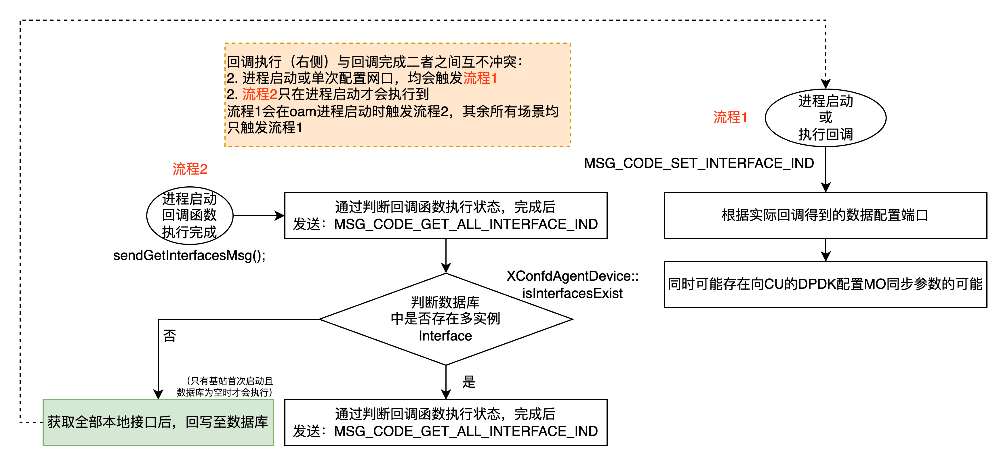
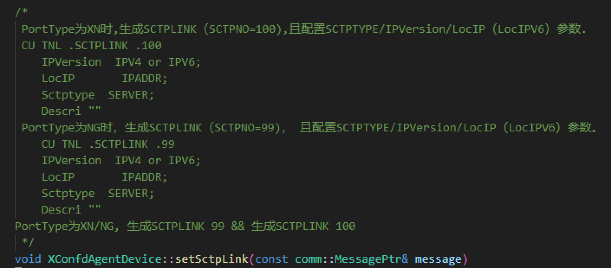
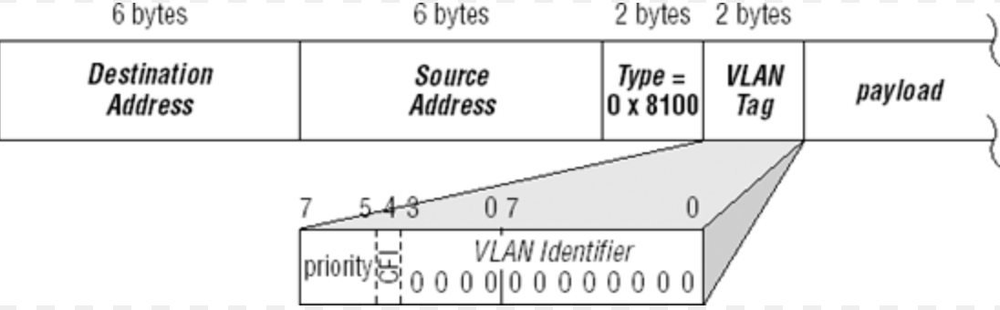

# 设备以及配置管理
主要涉及文件：
- yang > develop > yang > oam > dev_mgr > flexoran-dev-mgr.yang
- common > confd_message > src > xconfd_agent_device.cpp
- modules > device_manager > src > device_manager.cpp

### 主要负责功能

|  功能 |  描述 |
|---|---|
| 配置文件加载与处理 |  管理保存在本地的配置文件，并根据实际情况进行配置文件的加载与处理  |
| 网络接口配置 |  会根据实际情况获取或配置网络接口  |
| 网络路由配置 |  会根据实际情况获取或配置设备中的路由，包括静态路由或策略路由  |
| 设备基本信息监控、展示与上报 |  设备启动后，获取并定期对设备进行状态监控，并将监控结果上报至**PM性能统计模块**或配置模块  |

<br><br><br><br>

## 1.1 配置文件管理
本模块所管理的配置文件包括：

|  配置文件路径 | 描述  |
|---|---|
| [运行路径]oam/config/rru_schema_template/***.xml |  主要用于EU、RRU管理模块的netconf client，如果不加载这些配置文件可能导致报文发送出现问题  |
| [运行路径]LTE/user/Areao/lbp_FDD_RRU.sh |  给海能达LBP卡配置各类参数，主要是时延测量中的提前量（目前已经废弃，但具备应急属性）  |
| /proc/net/dev, /proc/net/if_inet6 |  (只读)用以获取接口名称等信息  |
| [运行路径]oam/config/routeTables |  用于保存配置好的策略路由，避免重启等导致的重复配置  |

本部分较为简单，具体细节不再展开描述，具体可阅读代码

<br><br>

<br><br><br>

## 1.2 网络接口配置
对设备（基站服务器）对外网络接口进行参数配置，主要包括但不限于以下几个方面：
- 设置网络接口的IP地址、子网掩码、网关等基本网络参数
- 设置网络接口的VLAN子接口下的VLANID、IP地址、子网掩码、网关等基本网络参数

### 1.2.1 网络接口和IP地址配置流程


<br><br>

### 1.2.2 网络配置时与CU之间的约定
由于CU维护着通往核心网的NG接口以及通往站间的XN接口的SCTP链路，且SCTP链路中包含了很多本地端口信息，所以在网络接口配置时，必然涉及一些修改需要向CU的配置模型MO进行同步的操作，以下几个函数作为较为典型的例子：



<br><br>

### 1.2.3 OAM相对南向接口新增的自定义vlan-qos参数说明
VLAN（虚拟局域网）中的 VLAN QoS（质量服务，Quality of Service）是用于确保不同类型的数据流在网络上传输时能够获得不同的优先级和处理方式，以满足不同的服务质量要求。这对于需要保证网络性能的应用程序非常重要，例如语音、视频和实时数据传输。但对于当前的基站系统来说，其主要用于区分网管（发往OMC）数据包和业务（发往NG）数据包的优先级配置。

基站在配置 VLAN QoS 的时候，NR-OAM只通过命令参数 egress配置了基站**出站**的流量控制。，与之相对的是 ingress，即入站（入接口）的流量NR-OAM没有控制和管理。**当前默认6个队列，均映射至同一个优先级，未做区分（这可能是个Gap，也可能是个缺陷。但是通常通往OMC的网管数据包和通往NG口的业务数据包分别位于不同的VLAN上，所以暂时问题应该不大。只不过如果使用同一个VLAN或NG业务优先级再进一步细化的话，可能存在一些优化空间）**
```c++
std::string egressMap = "";
if(vlanCfg.eVlanQos > 0)
{
    int8_t vQos = vlanCfg.eVlanQos;
    char egress[128] = {""};
    sprintf(egress, " egress 0:%d 1:%d 2:%d 3:%d 4:%d 5:%d 6:%d", vQos, vQos, vQos, vQos, vQos, vQos, vQos);
    egressMap = egress;
}
```
若想进一步了解，跳转到附录2：Qos与DSCP


<br><br>

## 1.3 路由配置
对设备（基站服务器）的路由表进行配置，主要包括但不限于以下几个方面：
- 管理静态路由
- 管理策略路由
- 默认网关与策略路由的关联

### 1.3.1 管理静态路由
首先明确基本概念，以下三个路由分类，均在Linux的路由main表中（其他分类在后边会说），通常情况下通过添加配置静态路由可以满足外场绝大部分场景
- 静态路由：静态路由是由网络管理员手动配置的路由。它们不会自动调整，因此在网络拓扑发生变化时需要手动更新。这种路由适用于小型网络或需要严格控制路由路径的环境
- 默认路由：默认路由是一种特殊的静态路由，用于将所有未明确指定路径的流量发送到一个指定的下一跳路由器。它通常用于连接到外部网络，例如互联网
- 直连路由：直连路由是指通过物理接口或Vlan子接口直接连接的网络。这些路由是将IP配置给对应的接口后，**自动添加到路由表中的**，只要接口是**启用**的并且处于工作状态


#### 静态路由配置代码入口：
OAM在配置静态路由以及路由策略时，如果该路由已经存在，其基础逻辑是先删除再建立
```C++
else if(op == XCONFD_OP_MODIFIED )
{
    routeInfo routeOld = {};

    getSingleRoute(yt, routeOld, false);
    // 删除该路由
    routeOld.act = comm::_DEL;
    ipRouteSetInd(routeOld);
    // 建立新的路由
    routeInput.act = comm::_ADD;
}
else
{
    return;
}

getSingleRoute(yt, routeInput);
ipRouteSetInd(routeInput);
```

#### 经典问题单分析（直连路由被修改）：
- [Bug4972 现场路由添加没有生效oam下发的路由命令没有成功，需要down+up虚拟口后才能正确生效](http://172.21.6.108/bugzilla/show_bug.cgi?id=4972)

**问题流程描述**：
1. 假设现场开设服务时，需要在veth0接口上添加一条对外通往VLAN ID为63子接口，并且对其配置了一个IP地址10.10.8.68（运营商为我们分配的本地IP地址）时，系统内核会自动生成一条直连路由，当 0.0.0.0 用作网关地址时，它表示流量直接发送到目标地址，而不需要通过任何中间网关。即，这种路由条目指向的网络是直接连接的（也称为直连路由）。类似如下：
    ```shell
    Dst           Gateway        Iface
    10.10.8.0     0.0.0.0        veth_0.63
    ```
2. 但是该直连路由的网关0.0.0.0不够确切，所以需要修改此网关地址，如下：
    ```shell
    ip -4 route change 10.10.8.0/24 via 10.10.8.254 dev veth_0.63

    Dst           Gateway        Iface
    10.10.8.0     10.10.8.254    veth_0.63
    ```
3. 此时再想针对该网关地址的路由时，**系统报错**

**问题分析**：这种修改是不合理的，因为直连路由是用于同一子网内的设备直接通信的。通过网关转发会导致以下问题：
- 额外的网络消耗：所有同一子网内的流量都需要绕经网关，增加了不必要的网络开销。
- 路由冲突：内核自动生成的直连路由优先级较高，用于直接通信。如果修改为通过网关，则会导致网络数据包的传输路径异常。
- 路由添加失败：由于修改了直连路由，后续添加其他网段或主机路由时会遇到冲突，导致路由添加失败。

**解决方案：** 当用户修改物理口默认网关的时候，OAM程序会自动匹配自定义的路由策略，而非直接修改系统生成好的直连路由。
- 函数入口：void XConfdAgentDevice::handleIfGatewayMod(ifIpcfg ifIp)


### 1.3.2 管理策略路由
策略路由（Policy-Based Routing, PBR）可以根据源地址、协议、端口等条件来决定流量的路由路径，而不仅仅依赖于目的地 IP 地址

在Linux当中，默认有以下三类路由表，配置文件位于/etc/iproute2/rt_tables：
- local路由表：包含路由到本地地址的条目，如环回地址和广播地址。在Linux中，默认的table-id为255
- main路由表：这是系统的默认路由表，包含所有通过普通配置添加的路由条目。在Linux中，默认的table-id为254
- default路由表：用于未指定的目的地（注，和main表中的default默认路由条目不是同一个概念）。在Linux中，默认的table-id为253

```shell
-bash-4.2# ip rule show
0:      from all lookup local
32766:  from all lookup main
32767:  from all lookup default
```

注：数字越小，优先级越高

#### 当然进一步的，通过使用自定义路由表来实现策略路由
- **自定义路由表**：用于特定的路由需求，可以通过ip route add *** table [自定义路由表名称]和rt_tables文件来定义和管理。自定义路由表通常用于策略路由，可以根据源地址、目的地址、接口等条件进行路由选择。
- **路由规则**（ip rule）：用于定义数据包如何匹配到不同的路由表。每个规则都有一个优先级，系统会按照优先级顺序进行匹配，找到第一个匹配的规则后就会使用该规则定义的路由表来转发数据包。

#### 策略路由规则代码入口：
与静态路由配置类似，OAM在配置策略路由以及路由策略时，如果该路由已经存在，其基础逻辑是先删除再建立
```C++
else if(op == XCONFD_OP_MODIFIED)
{
    // To delete the old rule.
    comm::ipRule ruleold = {};
    getsingleIpRule(yt, ruleold, false);
    ruleold.act = comm::_DEL;
    sendIpRuleSetInd(ruleold);
    rulecur.act := COMM::_ADD;
}
else 
{
    return 0;
}

getsingleIpRule(yt, ruleCur);
sendIpRuleSetInd(ruleCur);
```

#### 经典问题单分析（策略路由开发需求）：
- [Bug5605 S1-U链路自建立功能](http://172.21.6.108/bugzilla/show_bug.cgi?id=5605)

在此问题单中，OAM在程序中开发了映射到yang模型的和ip rule的配置策略路由的映射。允许操作人员在webLMT或命令行中对策略路由进行配置，问题单评论中，锦锦、循循已经做了较为详细的描述


<br><br><br><br>

## 1.4 设备信息监控与查看
对设备进行基本的监控，并将监控数据或结果上报至PM性能统计模块或主控模块
- 对设备进行监控，如CPU占用率，内存使用率，代码入口位于DeviceManager::start()函数中的后半部分，有一系列定时器启动入口
- 设备信息查看的回调函数，代码入口位于common > confd_message > src > xconfd agent_device.cpp 中的所有xconfd_reg_show_m回调注册中

本部分较为简单，具体细节不再展开描述，具体可阅读代码

<br><br><br><br>

## 附录1：iproute2 和 net-tools 的对比
NR-OAM程序内部，全部使用iproute2工具提供的命令对基站IP、VLAN、路由进行配置

### 什么是 iproute2 和 net-tools？
`iproute2` 和 `net-tools` 是两个在 Linux 上用于网络配置和管理的工具集。它们有一些重叠的功能，但也有显著的差异。以下是关于这两个工具集的简要说明及其差异：

### iproute2

#### 简介

`iproute2` 是一个功能强大且现代化的网络配置工具集，由 Alexey Kuznetsov 开发。它提供了多种命令，用于管理网络接口、路由表、隧道、流量控制和策略路由等。

#### 常用命令

- `ip`：管理网络接口和路由。
- `tc`：配置流量控制（流量整形）。
- `ss`：查看套接字状态，类似于 `netstat`。

#### 示例

- 显示网络接口：

    ```sh
    ip addr show
    ```

- 添加 IP 地址：

    ```sh
    ip addr add 192.168.1.100/24 dev eth0
    ```

- 显示路由表：

    ```sh
    ip route show
    ```

- 添加路由：

    ```sh
    ip route add 192.168.2.0/24 via 192.168.1.1
    ```

### net-tools

#### 简介

`net-tools` 是一个传统的网络配置工具集，最早开发于 1980 年代。它包括了一些经典的命令，如 `ifconfig`、`route`、`netstat` 等，这些命令在许多旧版本的 Linux 中被广泛使用。

#### 常用命令

- `ifconfig`：配置网络接口。
- `route`：管理路由表。
- `netstat`：显示网络连接和套接字状态。
- `arp`：显示和修改 ARP 缓存。
- `hostname`：显示或设置主机名。

#### 示例

- 显示网络接口：

    ```sh
    ifconfig
    ```

- 添加 IP 地址：

    ```sh
    ifconfig eth0 192.168.1.100 netmask 255.255.255.0
    ```

- 显示路由表：

    ```sh
    route -n
    ```

- 添加路由：

    ```sh
    route add -net 192.168.2.0 netmask 255.255.255.0 gw 192.168.1.1
    ```

### 关系与差别

1. **历史背景**：
    - `net-tools` 是一个较老的工具集，适用于早期的 Linux 系统。
    - `iproute2` 是一个较新的工具集，设计为更现代化和强大，适用于更复杂的网络配置需求。

2. **功能覆盖**：
    - `iproute2` 提供了更广泛的功能集，包括策略路由、流量控制、网络命名空间等高级功能。
    - `net-tools` 主要涵盖基本的网络接口配置和路由管理功能。

3. **命令集**：
    - `iproute2` 使用 `ip` 命令替代了 `net-tools` 中的多个命令（如 `ifconfig`、`route`、`netstat` 等），提供了更一致和灵活的语法。
    - `net-tools` 使用多个独立的命令来管理网络配置。

4. **维护和发展**：
    - `iproute2` 仍在积极维护和发展，新的网络功能通常首先在 `iproute2` 中实现。
    - `net-tools` 已经很少更新，新功能通常不再添加。

5. **系统默认**：
    - 在现代的 Linux 发行版中，`iproute2` 通常是默认安装和推荐使用的工具集。
    - `net-tools` 在一些旧的系统中仍然可用，但在新系统中可能需要手动安装。

### 总结

`iproute2` 和 `net-tools` 都是用于管理 Linux 网络配置的工具集。`iproute2` 更现代化和强大，提供了更丰富的功能和一致的命令语法，是当前主流的网络管理工具。`net-tools` 是一个传统工具集，虽然在许多老系统中仍被使用，但逐渐被 `iproute2` 所取代。

选择哪个工具集取决于你的具体需求和使用环境，但对于新的配置和管理任务，推荐使用 `iproute2`。

以下是他们之间的命令对比汇总


<br><br><br>
<a name="QosDscp"></a>

## 附录2：Qos与DSCP
VLAN（虚拟局域网）中的 VLAN QoS（质量服务，Quality of Service）是用于确保不同类型的数据流在网络上传输时能够获得不同的优先级和处理方式，以满足不同的服务质量要求。这对于需要保证网络性能的应用程序非常重要，例如语音、视频和实时数据传输。

### 配置Qos优先级
```shell
# 配置 VLAN egress 映射关系，这个映射关系用于指定不同 VLAN 优先级（0-7）应当如何映射到 802.1p 用户优先级字段中的值
sudo ip link set dev eth0.100 type vlan egress 0:0 1:1 2:2 3:3 4:4 5:5 6:6 7:7
```
**这个Qos的egress标记及其对应的映射关系暂时还没理解透彻，需要进一步研究。猜测：如何使用，是在之后网络中的交换机或其他网络设备决定的**



- Priority（用户优先级）：3 位，用于标识流量的优先级（0-7）。
- CFI（Canonical Format Indicator）：1 位，通常设置为 0。
- VLAN ID：12 位，用于标识 VLAN。


### DSCP 和 QoS 的关联

1. DSCP 标记（**OAM对外网络包的Dscp标记可配置：/flexoran-5gnr/device-manager/conif-cfg/interface-mapping/dscp**）：
    - 应用程序或网络设备可以在数据包头部设置 DSCP 标记，用于指示数据包的优先级
    - OAM对外网络包主要是TR069网管协议，处理该DSCP标记可参考cwmp_trans代码
    - DSCP 值在 IP 头部的 TOS 字段中，占 6 位，可以表示 64 种不同的服务等级
2. QoS 策略：
    - QoS 策略用于管理和优化网络流量，可以包括流量分类、排队、调度、整形和策略等。
    - 网络设备（如交换机和路由器）会根据 QoS 策略，对数据包进行优先级处理。
3. 队列管理（Queue Management）：
    - 网络设备通常有多个队列（例如 0 到 7），用于处理不同优先级的流量。
    - 数据包根据 DSCP 值被分类到不同的队列，优先级高的流量放到高优先级的队列中。

#### 应用场景

1. 应用程序：可以设置 DSCP 标签，以指示数据包的优先级。
2. Linux 服务器：可以通过 tc 工具配置 QoS 策略，将流量分配到不同的队列，并设置不同的优先级。
3. 交换机：可以根据 DSCP 标签和 QoS 队列之间的映射关系，优先处理高优先级的流量。


<br><br><br><br>

## 附录3：静态路由配置
在 Linux 系统中，路由表存储了网络路由信息。每条路由定义了从源网络到目标网络的路径。路由表的每一条目包含以下字段：
- 目标网络：目标 IP 地址或网络。
- 网关：下一跳 IP 地址，数据包将通过该地址进行传输。
- 网络接口：通过哪个网络接口发送数据包。
- 度量值：优先级，值越小优先级越高。

### 默认路由
默认路由是一种特殊类型的路由条目，它用于在没有其他特定路由匹配目标地址时，将数据包发送到一个指定的网关。这通常用于将所有未明确匹配其他路由的流量发送到一个出口网关。在路由表中，默认路由通常表示为目标网络 0.0.0.0/0，这意味着任何目的地 IP 地址都匹配这条路由。它的网关通常是你的外部网关地址。

### 路由优先级
路由优先级是用来确定当多个路由条目匹配同一个目标地址时，应该使用哪条路由的规则。在 Linux 系统中，路由优先级通常由两个参数决定：metric 和 prefix length。
- Metric（度量值）：度量值是一个整数，用来表示路由的优先级。**值越小，优先级越高**。通常情况下，默认路由的度量值较高。
- Prefix Length（前缀长度，子网掩码）：前缀长度是网络地址的子网掩码长度，表示网络的具体程度。前缀长度越长，匹配的网络范围越小，优先级越高。例如，192.168.1.0/24 比 192.168.0.0/16 更具体，所以优先级更高。

```shell
[root@bj-certusnet bin]# route -n
Kernel IP routing table
Destination     Gateway         Genmask         Flags Metric Ref    Use Iface
0.0.0.0         172.21.6.1      0.0.0.0         UG    0      0        0 enp3s0
10.10.8.0       0.0.0.0         255.255.255.0   U     0      0        0 veth_0
10.10.9.0       0.0.0.0         255.255.255.0   U     0      0        0 F1UCU
.......
172.21.17.0     0.0.0.0         255.255.255.0   U     0      0        0 certus_tap0
192.168.122.0   0.0.0.0         255.255.255.0   U     0      0        0 virbr0

# OR

[root@bj-certusnet ~]# ip route show
default via 172.21.6.1 dev enp3s0 
10.10.9.0/24 dev F1UCU proto kernel scope link src 10.10.9.20 
10.10.9.0/24 dev F1UDU proto kernel scope link src 10.10.9.40 
10.10.10.0/24 dev F1CCU proto kernel scope link src 10.10.10.10 
10.10.10.0/24 dev F1CDU proto kernel scope link src 10.10.10.30 
10.11.1.0/24 dev enp101s0f0 proto kernel scope link src 10.11.1.130 
169.254.0.0/16 dev enp101s0f0 
169.254.0.0/16 dev enp3s0 scope link metric 1002 
169.254.0.0/16 dev enp101s0f0 scope link metric 1005 
172.21.6.0/24 dev enp3s0 proto kernel scope link src 172.21.6.51 
192.168.122.0/24 dev virbr0 proto kernel scope link src 192.168.122.1
```


<br><br><br><br>

## 附录4 OAM策略路由使用说明

```ini
1.新增数据模型参数
-新增了route配置table-id 参数
flexoran-5gnr device-manager routes route table-id   - 路由表ID[0:255]
-新增了rules 路由策略的配置
flexoran-5gnr device-manager rules rule 
Possible completions:
  dst-ip-network - 目的网络[defalut][any][all][*/*]
  interface-name - 接口名称
  ip-version     - IP版本
  priority       - 优先级
  src-ip-network - 源网络[defalut][any][all][*/*]
  table-id       - 路由表ID[0:255]
说明：以上新增的参数为非运营商数据模型中的参数，为私参，只能通过confd_cli或weblmt进行配置操作

2,配置指定table id的路由和策略路由
使用confd_cli，veth_0 ip:10.10.5.69, 网关：10.10.5.1
set flexoran-5gnr device-manager routes route 15 interface-name veth_0 dst-ip-network 10.10.0.0 prefix-length 16 gateway-ip-address 10.10.5.1 ip-version ipv4 table-id 2
该操作触发OAM添加一条路由：命令为ip -4 route add 10.10.0.0/16 via 10.10.5.1 dev veth_0 table 2

添加路由策略：
--指定原网络
set flexoran-5gnr device-manager rules rule 0 src-ip-network 10.10.5.69/32 interface-name veth_0 ip-version ipv4 priority 32765 table-id 2
该操作触发OAM添加一条路由策略： ip -4 rule add from 10.10.5.69/32 dev veth_0 priority 32765 table 2

--指定目的网络
set flexoran-5gnr device-manager rules rule 1 dst-ip-network 20.20.5.0/24 interface-name veth_0 ip-version ipv4 priority 32765 table-id 2
该操作触发OAM添加一条路由策略：ip -4 rule add to 20.20.5.0/24 dev veth_0 priority 32765 table 2

--指定原网络和目的网络
set flexoran-5gnr device-manager rules rule 2 src-ip-network 10.10.0.0/16 dst-ip-network 20.20.0.0/16 interface-name veth_0 ip-version ipv4 priority 32765 table-id 2
该操作触发OAM添加一条路由策略：ip -4 rule add from 10.10.0.0/16 to 20.20.0.0/16 dev veth_0 priority 32765 table 2

在ssh终端通过ip rule查看路由策略：
[root@bj-124 ~]# ip rule list table 2
32765:  from all to 20.20.5.0/24 iif veth_0 lookup 2
32765:  from 10.10.5.69 iif veth_0 lookup 2
32765:  from 10.10.0.0/16 to 20.20.0.0/16 iif veth_0 lookup 2
[root@bj-124 ~]#

删除配置：
root@bj-124% delete flexoran-5gnr device-manager rules rule 0
root@bj-124% delete flexoran-5gnr device-manager rules rule 1
root@bj-124% delete flexoran-5gnr device-manager rules rule 2
root@bj-124% commit


3.接口默认网关
配置接口的默认网关，会触发如下操作：
--生成一条默认路由（路由表ID范围[1:252]）
--生成一条指定源网络（接口ip：10.10.5.69/32）的路由策略
如果需要如上其他路由表的默认路由和策略，可以通过配置接口的默认网关配置，不需再手动配置路由和策略。
示例：
root@bj-124> show all flexoran-5gnr device-manager interfaces interface 0 ipv4-list 1
ip        10.10.5.69;
gateway   0.0.0.0;   # 0.0.0.0
netmask   255.255.255.0;   # 255.255.255.255
origin    static;
port-type OTHER;
[ok][2024-02-23 16:53:32]
root@bj-124>
#配置接口默认网关 10.10.5.1：
root@bj-124% set flexoran-5gnr device-manager interfaces interface 0 ipv4-list 1 gateway 10.10.5.1
[ok][2024-02-23 16:56:13]

[edit]
root@bj-124% commit

#由如上接口网关10.10.5.1配置触发生成的默认路由
root@bj-124> show all flexoran-5gnr device-manager routes route 15
ip-version         ipv4;   # ipv4
dst-ip-network     default;
prefix-length      0;   # 0
gateway-ip-address 10.10.5.1;
interface-name     veth_0;
table-id           8;
[ok][2024-02-23 16:58:29]

#由如上接口网关10.10.5.1配置触发生成的路由策略
root@bj-124> show all flexoran-5gnr device-manager rules rule 0
ip-version     ipv4;   # ipv4
src-ip-network 10.10.5.69/32;
interface-name veth_0;
table-id       8;
[ok][2024-02-23 16:58:38]
root@bj-124>

#由如上接口网关10.10.5.1配置触发生成的默认路由和路由策略对应的linux命令：
ip -4 route add default via 10.10.5.1 dev veth_0 table 8
ip -4 rule add from 10.10.5.69/32 dev veth_0 table 8

4.常用命令
-查看所有路由表下的路由信息：ip route show table all
-查看指定路由表下的路由：ip route list table 2（2为路由表ID）
-查看路由策略：ip rule

5.注意事项
配置的路由和策略需要是真实有效的，才能下发到环境中配置成功。
以上是通过confd_cli命令示范，可以使用weblmt进行操作。
```


# 参考
## Qos概述
- https://cshihong.github.io/2018/02/05/QoS%E6%A6%82%E8%BF%B0/


# Change Log
|  Date (YYYY-MM-DD) |  Version | Changed By  |  Change Description |
|---|---|---|---|
| 2024-07-17  | 1.0  | Guoliang  |  创建文档并完成基本内容 |

