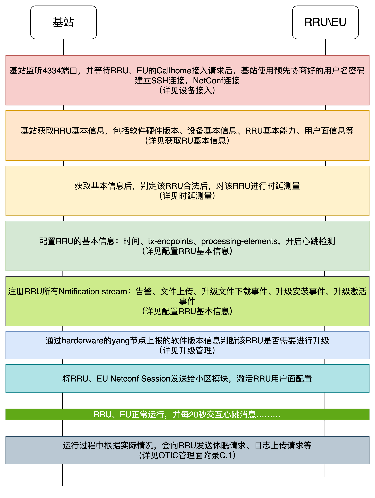
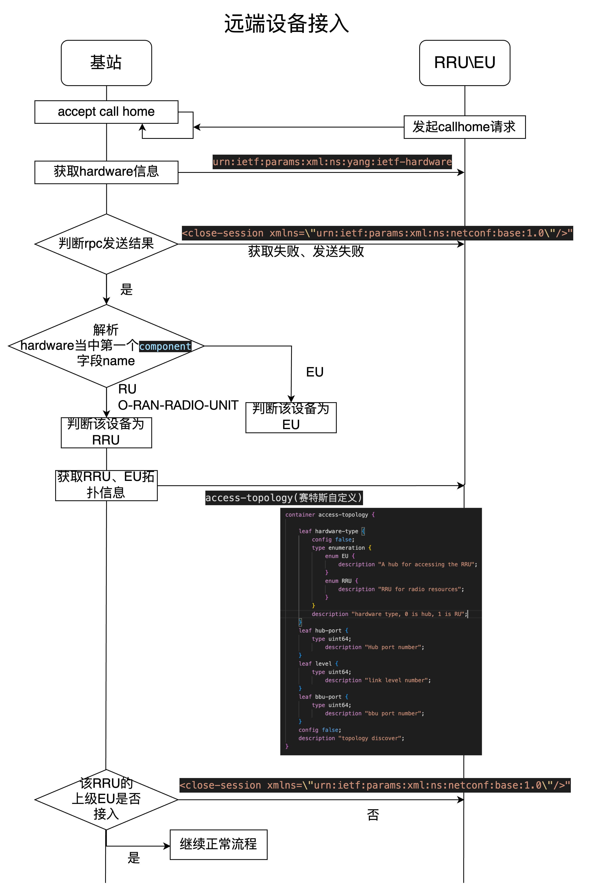
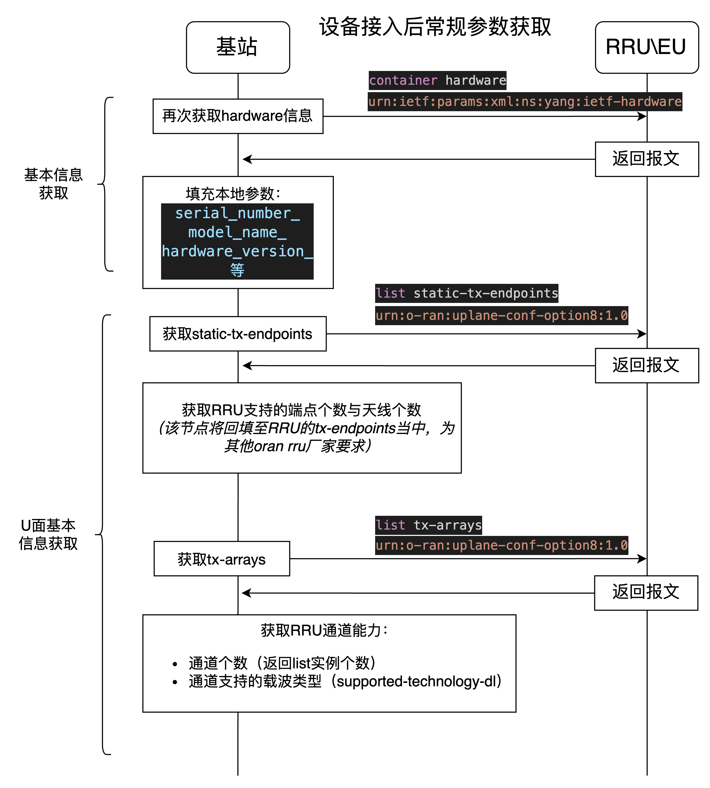
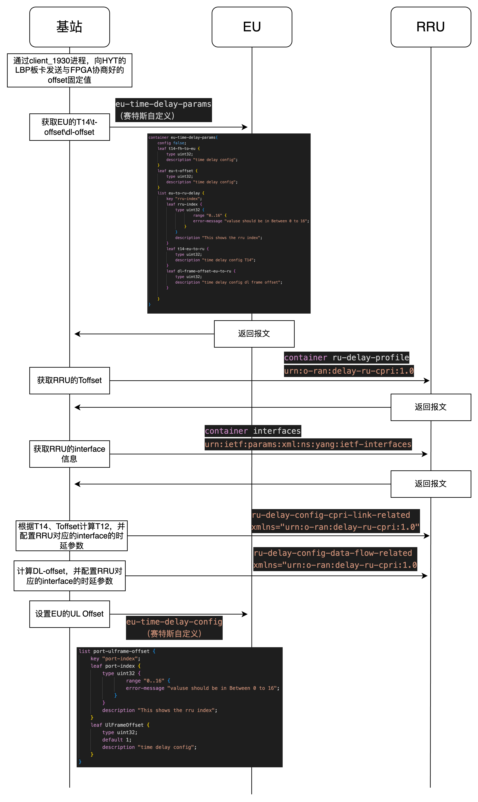
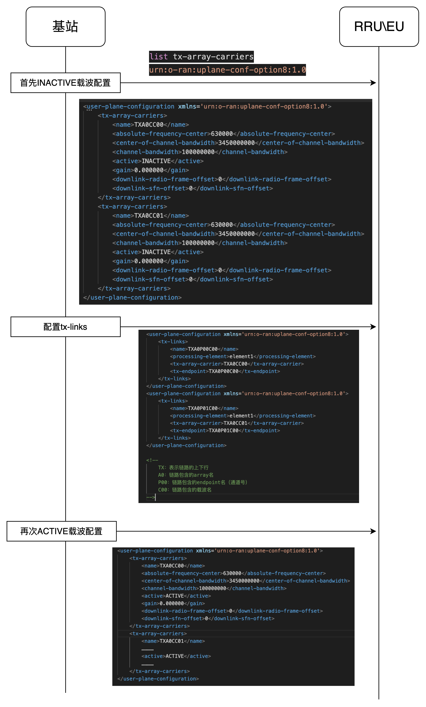
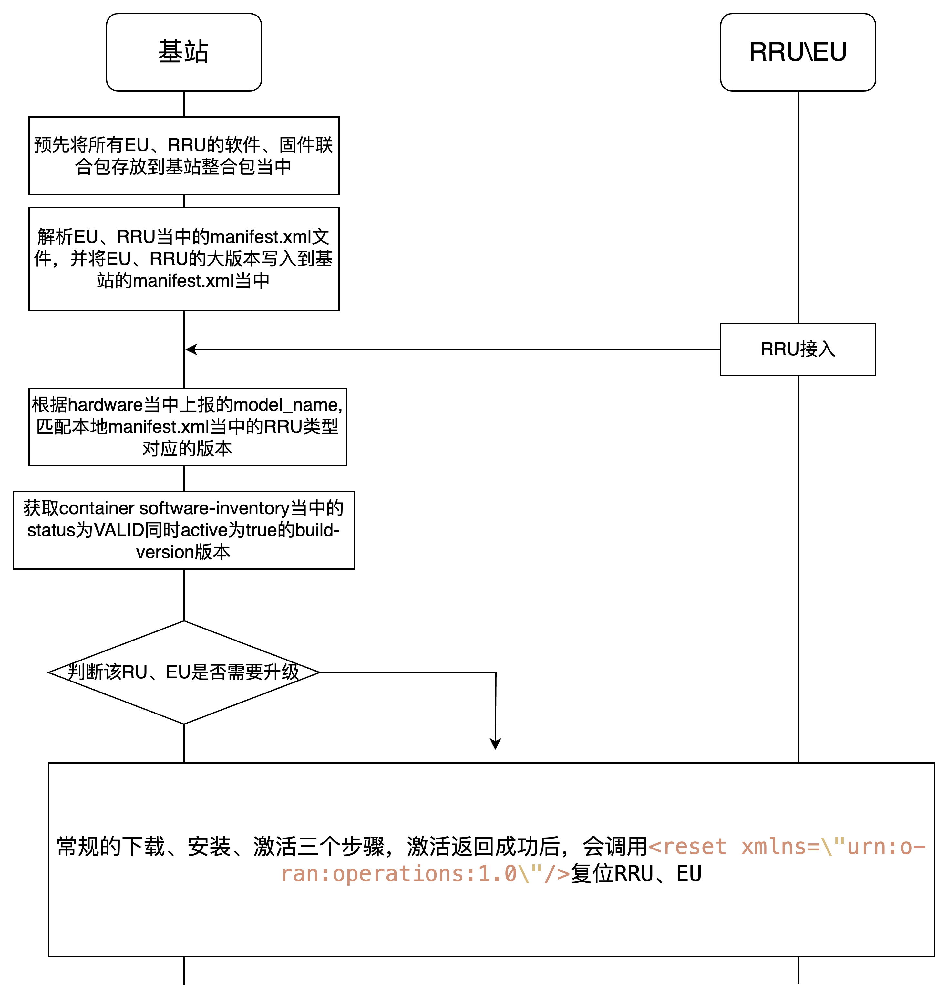
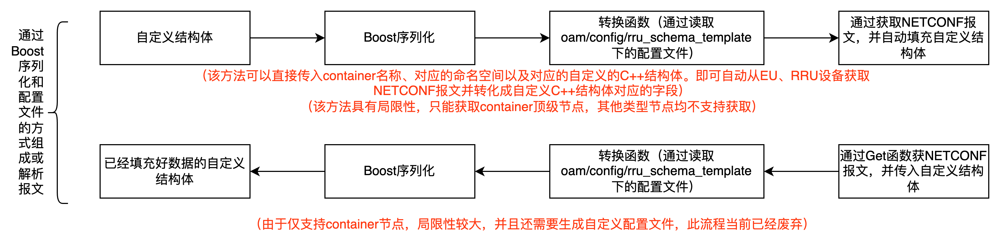
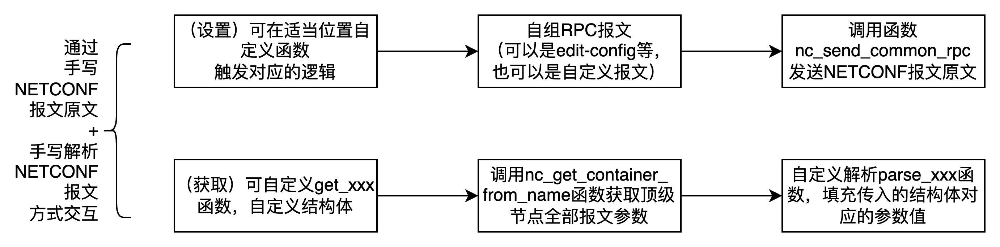
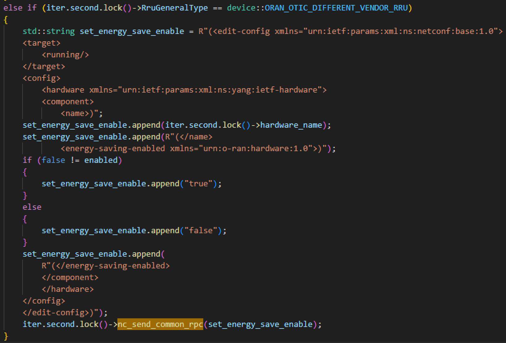
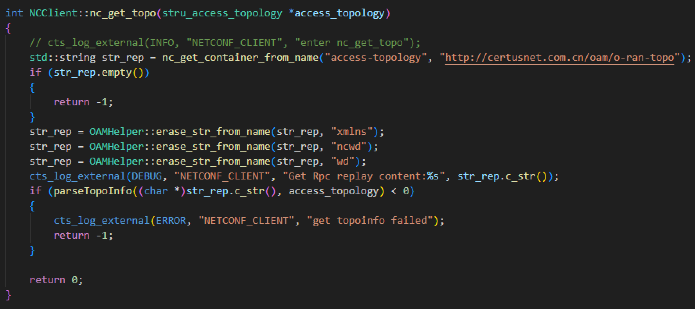

# EU\RRU管理与NETCONF client（基站侧）

## 1. 总体与各个流程梳理
### 1.1 总体流程


### 1.2 设备接入和认证

- **第一步，CALLHOME**：当基站侧硬件状态均准备完成后，随即可以开始监听4334端口，以便接收来自EU或RRU的Callhome消息，以下是代码实例，目前x86设备使用网口certus_tap0，另一个编译宏CC_ARM64为NXP平台的前传网口br1(此方案已废弃)，后续需要根据实际情况进行修改。
- **第二步，设备校验**：当前我司已经成功对接至少四家厂家的RRU设备（芯通、锐捷、典格以及我们自研设备）和我们自研的EU设备，所以在设备接入前要对厂家信息作一些基本校验
- **第三步，获取设备topo**：从EU、RU侧通过自定义yang模型获取topo信息
- 以下是设备接入和校验的代码入口和部分代码展示
```c++
void *CallHomeAcceptor::wait_rru_callhome(void *__this)
{
    prctl(PR_SET_NAME, "CallHomeACP");
    CallHomeAcceptor *_this = (CallHomeAcceptor *)__this;
#ifdef CC_ARM64
    auto netconfNicStatus = OAMHelper::nic_status("br1");
#else
    auto netconfNicStatus = OAMHelper::nic_status("certus_tap0");
#endif
    if (netconfNicStatus.compare("UP") == 0)
    {
        nc_set_default_key();
#ifdef CC_ARM64
        _this->address_ = "10.60.0.1";
        cts_log_external(INFO, "CALL_HOME", "br1 is RUNNING!");
#else
        cts_log_external(INFO, "CALL_HOME", "certus_tap0 is RUNNING!");
#endif
        if (-1 == nc_client_ssh_ch_add_bind_listen(_this->address_.c_str(), _this->port_))
        {
            // 详细处理
        }
    }

    // ......
}
```


### 1.3 获取EU，RRU基本信息

- EU相比RRU较为简单，获取厂家基本信息即可
- **RRU代码入口**：modules > rru_manager > src > rru_agent.cpp > set_rru_hardware_info_to_topo()
- **EU代码入口**：modules > eu_manager > src > eu_agent.cpp > set_eu_hardware_info_to_topo()


### 1.4 向RRU配置参数
当从RRU侧获取完基本参数后，随后会根据不同的需求，如动态AGC、RRU内外置天线、压缩非压缩等，向RRU侧发送相应的配置参数。流程图省略，代码入口和函数如下：
```c++
bool RruAgentManager::rru_agent_config(std::shared_ptr<RruAgent> rru_instance)
{
    // 根据IP地址区分，该RRU是否是重复接入
    auto it = rruAgentMap_.find(rru_instance->ipaddr_);
    if (it != rruAgentMap_.end())
    {
        //.....
    }

    // 认证该RRU合法，并写入数据库

    ru_instance->set_rru_hardware_info_to_topo();    // 更新拓扑数据RU硬件版本，通道个数等信息
    ru_instance->set_route_index_to_topo();          // 设置RU路由索引信息
    ru_instance->set_sft_package_version_to_topo();  // 写包与更新RRU软件信息
    ru_instance->set_rru_external_io();              // 更新外部的配置
    set_rru_antenna_io(rru_instance);                // 更新天线配置
    ru_instance->set_rru_mgc_agc();                  // 核心算法配置
    ru_instance->set_rru_optic();                    // 配置光模块的外置

    // 向海能达LBP卡发送与FPGA协商好的配置（见1.1.4）....
}
```


### 1.5 时延测量
当RRU基本信息和基础配置均完成后，随即进入与业务相关的RRU、EU配置，最重要的，也是第一个需要配置的是时延测量。其流程如下：<br>

- **开始向海能达LBP发送时延测量值的函数入口**：
  - modules > rru_manager > src > rru_agent_manager.cpp > sendSimRruToLteMsg(void *)
  - 其中，"client_rru_1930"的代码位于海能达LTE代码库： enb / PLATFORM / cts_rru_sim / client.c
- **开始向EU、RRU设备发送时延测量值的函数入口**：
  - modules > rru_manager > src > rru_agent_manager.cpp > rru_fiber_timedelay_access(std::shared_ptr<RruAgent>)


### 1.6 用户面配置
用户面配置由于涉及到CELL模块，所以由ERU管理模块负责调用CELL模块提供的方法，并在调用时eu、rru指针传入

- **CELL模块处理Uplane的函数入口**：modules > cell_manager > src > cell_manager.cpp > update_cell_instance_rru_info(std::weak_ptr<device::RruAgent>, uint32_t)
  - 芯通、锐捷以及自研RRU由于涉及到的具体流程稍有差别，所以代码流程也稍有不同，具体可见函数中的代码处理，不再示意图中体现


### 1.7 ERU升级
下图为单个EU或RRU的简易升级流程，其中省略了下载、安装、激活、重启这四大步骤，这四大步骤可以去ORAN原文[O-RAN.WG4.MP0-v03.00](http://172.21.6.174:4000/Attachment/O-RAN.WG4.MP.0-v03.00.pdf)中获取

- 多EU、RRU升级可见[基站升级优化方案](./SpecificFunction/UpgradeRefineFunction/upgrade_refine_function.md)


## 2. NETCONF Client
基站通过作为NETCONF Client的身份，向EU或RRU发送配置或RPC时，在当前OAM的代码处理中可以分为以下几个不同场景
### 2.1 boost序列化
在项目早期，由于希望能够通过较为简单的使用方式来获取或配置EU、RRU上的基础信息，基本逻辑如下图所示，即使用者只需要知道需要获取的container名称、命名空间以及和这个container对应的自定义C\C++结构体，即可通过调用统一的函数，即可自动将从EU、RRU获取到的NETCONF报文填充到对应的C\C++结构体中。

- **代码入口**：template <typename T> bool nc_edit_container_valid_check_from_name(string name, string ns, T &val)
- 如图中所述，由于早期代码实现局限性较大，且需要加载自定义的配置文件。故该方式目前并不被推荐使用，可参考2.2 发送自定义RPC的方式进行处理
- 可通过搜索给出的函数，即nc_edit_container_valid_check_from_name来了解整个流程以及当前已经支持的配置项


### 2.2 发送自定义RPC
如上段所说，可以通过自己编写RPC报文的方式，来发送或者获取NETCONF报文，设置可通过函数nc_send_common_rpc发送自定义报文，获取则可通过编写自定义的parse函数实现


#### 2.2.1 发送自定义RPC实例


#### 2.2.2 获取自定义RPC



### 2.3 接收Notification
接收Notification通过回调函数处理，注册函数如下（搜索该注册函数可以获取对应例子参考）：
- common > netconf_client > src > netconf_client.cpp > **nc_create_notification**(string, nc_session *, void(* )(nc_session *session, const nc_notif *notif))


# Change Log
|  Date (YYYY-MM-DD) |  Version | Changed By  |  Change Description |
|---|---|---|---|
| 2024-07-22  | 1.0  | Guoliang  |  创建文档并完成基本内容 |
