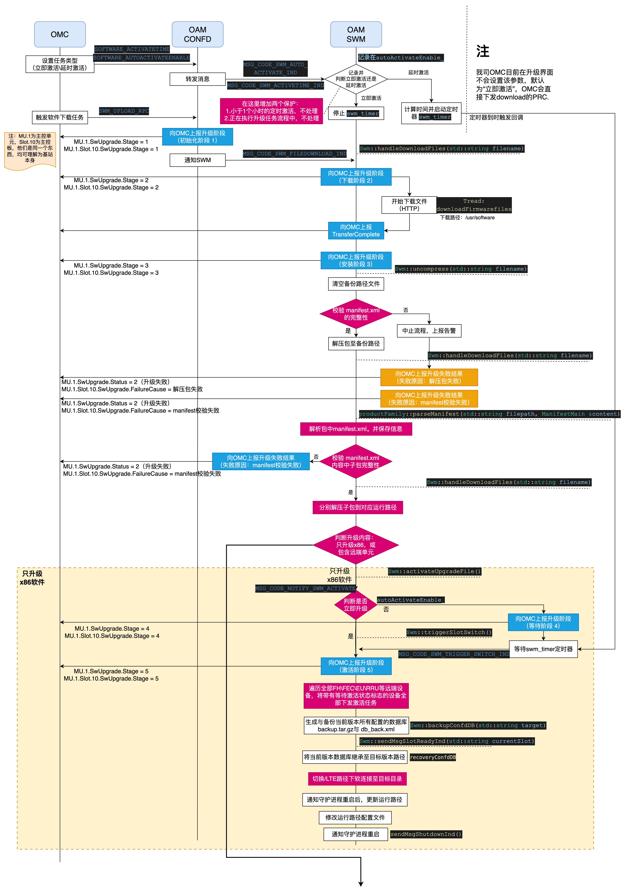
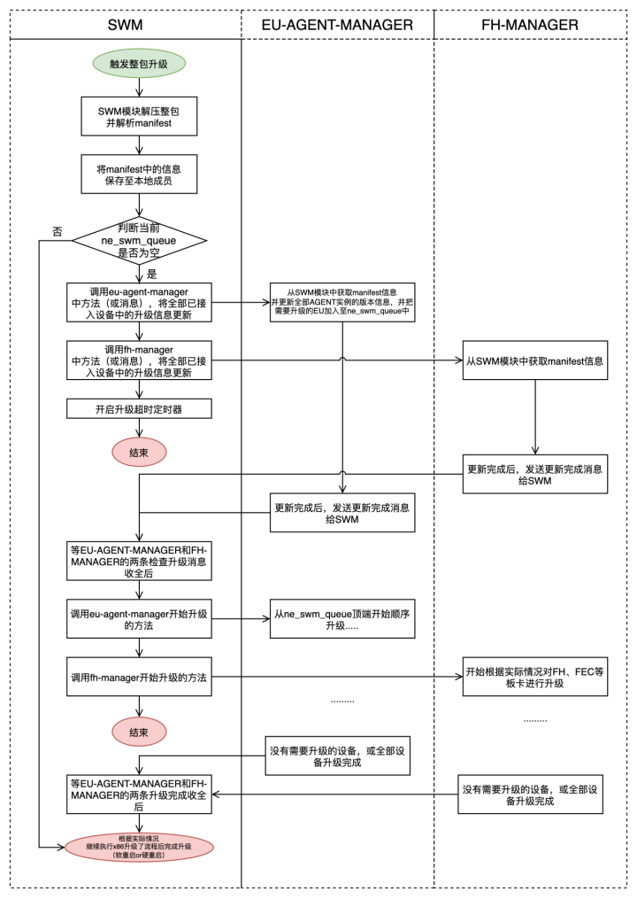
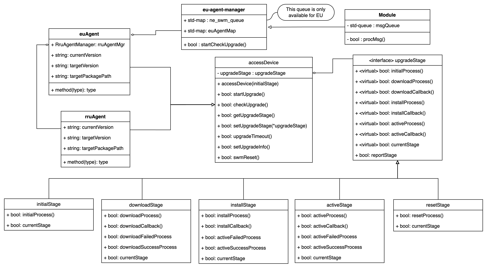
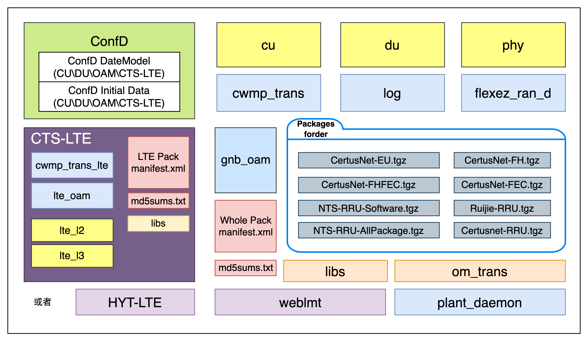
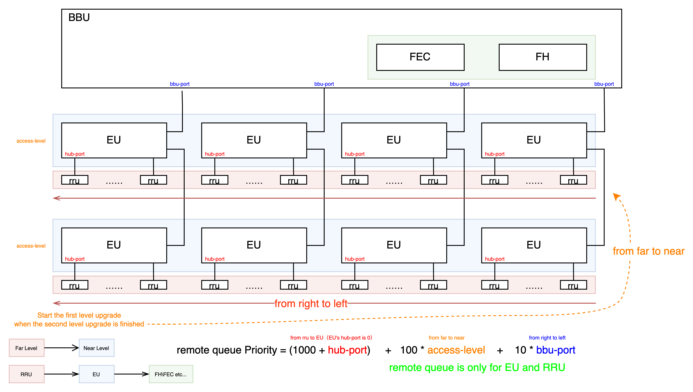

# 软件升级管理

## 1.1 软件升级流程综述
整体软件升级流程见下图，改图包含了x86软件部分的升级流程，参考下图后，可以较为顺利的找到软件升级流程的起点，并且根据实际情况进行后续的优化工作，其中远端单元（前传卡、EU、RRU）是异步进行的，所以会在后续章节中体现



- 上图流程已经较为完整，且带有详细的消息宏，就不再更多的文字说明


## 1.2 远端单元升级流程
以下流程为R5及其以后版本的EU、RRU升级流程（R3、R4版本采用的是队列式的串行的升级方式，该方式放在附录中简单说明）




- 前传卡升级流程，可参考：[加速卡总体设计说明](A2-C0-fh_overview.md) 2.1章节 前传卡升级流程
 
其他补充修改点：
- 当升级流程中，屏蔽6202、6204、1019、1020告警
- 新增一条升级失败告警，该告警有如下详细定位信息：
- 设备接入升级过程中不允许用户下发整包升级（设备接入升级流程完毕后清除该告警）
  - 远端设备（EU、RRU）有部分或全部升级失败
  - 基带板（FH、FEC）有部分或全部升级失败
- 增加一个控制开关，用于屏蔽远端设备的全部升级流程（实验室功能，默认关闭）
- 增加一个控制开关，用于屏蔽基带板的全部升级流程（实验室功能，默认关闭）
- 增加一个RPC，专门用于清空远端设备升级队列。用于在极端场景下的环境恢复或测试开发环境下可能出现的终止升级需求


### 1.2.1 EU、RRU升级功能类图
EU、RRU升级功能，参考设计模式当中的状态模式划分，类图如下：


修改点说明：
1. 下载、安装、激活从manager类挪到一个upgradeStage的抽象类当中（状态模式），代码逻辑更加清晰的同时，改为由各自Agent控制升级流程，自己的升级流程执行完毕后，通过upgradeStage的衍生类来自行控制升级阶段的流转
2. RRU Agent触发升级时只需关注自己的升级流程即可，EU Agent触发升级时，需要同时触发其下属需要升级的RRU的升级流程，并需要关注其下挂RRU的升级流程
3. 升级队列由原来的保存所有EU、RRU升级任务（ne_swm_queue），变更为只保存EU的升级任务，且删除掉原来queue当中所保存的升级详细信息，并将ne_swm_queue改为map类型，便于后续索引与查找
4. 将全部升级详细信息保存至accessDevice类中，在整包升级触发或接入时将对应信息填入，随后由eu-manager-manager的升级入口统一触发升级时，设备是否升级，由设备自己进行判断


### 1.2.2 升级信息直接保存至ERU对象实例
在系统初始化时，swm模块自动读取manifest.xml当中所有设备的版本信息，并保存至私有成员当中，并对外提供查询接口，支持通过model-name索引返回此型号对应的目标版本号、版本包路径。
当EU、RRU设备通过Callhome接入到系统中时，统一由eu-agent-manager模块从swm模块通过model-name获取到此EU、RRU所对应的整包信息（目标版本号、版本包路径）并回填至EU、RRU的实例信息当中。
当触发整包升级时，由swm模块解析目标版本的manifest.xml当中的全部的版本信息，并将版本信息通过消息的方式发送给eu-agent-manager模块，再由eu-agent-manager模块将全部版本信息更新到所有的EU、RRU Agent实例当中（目标版本号、版本包路径）。

### 1.2.3 升级队列的执行逻辑
在eu-agent-manager类当中，存在一个方法，该方法用于触发全部接入设备的升级动作的方法，该方法有两个入口：
- 一个是SWM在判断整包升级时，通过消息或函数调用的方式将manifest中的EU、RRU升级版本信息带给eu-agent-manager类后，由此manager类判断所有现已接入的EU、RRU设备，并统一更新ne_swm_queue容器后，再由SWM模块统一触发升级流程
- 另一个是EU、RRU设备接入过程中，判定为需要升级的情况，立即触发队列升级方法(详见 1.2 远端单元升级流程)
每当当前正在升级的EU触发了激活操作后，通过之前原有的消息触发下一个EU的升级流程（函数performEuRruUpgradeTask）一致，只不过从pop队列改为读取map类型的最高优先级的EU设备。


## 1.3 整包结构
目前我司产品仍然以x86产品线为主，当前整包结构如下：


图中所提及的manifest.xml配置文件结构与其中节点说明如下：
```xml
<!-- manifest文件生成与使用实例说明 -->
<?xml version="1.0" encoding="utf-8"?>
<xml>
    <!-- manifest下的version代表整包的大版本号,由打包时参数人为填入 -->
    <manifest version="FlexEZRan-R3Build02">
        <!-- products为总索引，遍历该标签，可了解当前整合包中都包含了哪些组件 -->
        <!-- build-Id:关联builds标签 -->
        <!-- code:指示该产品包适用于哪个类型的硬件设备，关联o-ran-hardware当中的model-name (build-Id 1\2为x86软件包，可忽略该参数) -->
        <!--      该产品包支持或需要包含多少产品组件，由打包脚本参数决定，code和取用文件之间的关联关系在打包脚本中写死 -->
        <!-- name:指示该产品包的类型，比如软件包、FPGA包、整合包等 -->
        <!-- vendor:指示该产品包的厂家 -->
        <products>
            <product build-Id="1" code="flexEZRan-NR-x86" name="FlexEZRan-gNB-Package" vendor="CertusNet"/>
            <product build-Id="2" code="flexEZRan-LTE-x86" name="FlexEZRan-LTE-Package" vendor="CertusNet"/>
            <product build-Id="3" code="06202003\.f3600" name="FlexEZRan-FH-Package" vendor="CertusNet"/>
            <product build-Id="4" code="06202003\.f3600" name="FlexEZRan-FEC-Package" vendor="CertusNet"/>
            <product build-Id="5" code="06202003\.f3600" name="FlexEZRan-EU-Firmware-Package" vendor="CertusNet"/>
            <product build-Id="6" code="06202003\.f3600" name="FlexEZRan-EU-Software" vendor="CertusNet"/>
            <product build-Id="7" code="06202003\.f3600" name="NTS-OTIC-RRU-Software" vendor="NTS"/>
            <product build-Id="8" code="06202003\.f3600" name="NTS-OTIC-RRU-Firmware" vendor="NTS"/>
            <product build-Id="9" code="06202003\.f3600" name="FlexEZRan-OTIC-RRU-All-Package" vendor="CertusNet"/>
        </products>
        <builds>
            <!-- bldVersion是人为赋予的，即打包时脚本参数，如FlexEZRan-R2Build05 -->
            <build bldName="FlexEZRan-gNB-Package" id="1" bldVersion="FlexEZRan-R2Build05">
                <!-- fileName:带有本地相对路径与文件名，直接取用该字段与path字段配合，即可统一化的处理软件包中所有组件到 -->
                <!-- path:为升级流程中，解压后，需要将该包存放到的**目标目录**的相对路径中 -->
                <!-- fileVersion:为组件发布人在发布时赋予的，由打包脚本解析并填入 -->
                <!-- checksum:该文件的md5 digest，用于完整性校验 -->
                <file checksum="d5028a8397cfae0da398599efbff062a" fileName="confd" fileVersion="1.0" path=""/>
                <file checksum="c3d68453370c9274c68b331a5a02aba0" fileName="cu" fileVersion="1.0" path=""/>
                <file checksum="fa85b0cdf802bb17e8ca5116a8b8876b" fileName="du" fileVersion="1.0" path=""/>
                <file checksum="fa85b0cdf802bb17e8ca5116a8b8876c" fileName="phy" fileVersion="phy_r1_20210922_1601_786708" path=""/>
                <file checksum="04ad528a58f8fe41b1d7c6c2d8d4ff5a" fileName="cwmp_trans" fileVersion="1.0" path=""/>
                <file checksum="04ad528a58f8fe41b1d7c6c2d8d4ff5b" fileName="cwmp_trans_lte" fileVersion="1.0" path=""/>
                <file checksum="886d7bdbf768edeb71f5bdf9ac7fbea9" fileName="oam" fileVersion="SW-VER-6f39fea9-202111151404" path=""/>
                <file checksum="886d7bdbf768edeb71f5bdf9ac7fbea1" fileName="libs" fileVersion="1.1" path=""/>
            </build>
            <build bldName="FlexEZRan-eNB-LTE-Package" id="2" bldVersion="B062">
                <file checksum="d5028a8397cfae0da398599efbff062b" fileName="LTE" fileVersion="B062" path=""/>
            </build>
            <build bldName="FlexEZRan-FH-Package" id="3" bldVersion="1.0">
                <file checksum="d5028a8397cfae0da398599efbff062c" fileName="packages/Fh.tgz" fileVersion="1.3" path="oam/packages/"/>
            </build>
            <build bldName="FlexEZRan-FEC-Package" id="4" bldVersion="1.0">
                <file checksum="d5028a8397cfae0da398599efbff062d" fileName="packages/Fec.tgz" fileVersion="1.1" path="oam/packages/"/>
            </build>
            <build bldName="FLEXBBU.3600" id="5" bldVersion="1.0">
                <file checksum="d5028a8397cfae0da398599efbff062e" fileName="packages/EU_hw.tgz" fileVersion="2.7" path="oam/packages/"/>
            </build>
            <build bldName="FLEXBBU.3600" id="6" bldVersion="1.0">
                <file checksum="d5028a8397cfae0da398599efbff062f" fileName="packages/EU_sw.tgz" fileVersion="v1833" path="oam/packages/"/>
            </build>
            <build bldName="FLEXBBU.3600" id="7" bldVersion="1.0">
                <file checksum="d5028a8397cfae0da398599efbff062g" fileName="packages/NTS-RRU-sw.tgz" fileVersion="1.0" path="oam/packages/"/>
            </build>
            <build bldName="FLEXBBU.3600" id="8" bldVersion="1.0">
                <file checksum="d5028a8397cfae0da398599efbff062h" fileName="packages/NTS-RRU-fw.tgz" fileVersion="1.0" path="oam/packages/"/>
            </build>
            <build bldName="FLEXBBU.3600" id="9" bldVersion="1.0">
                <file checksum="d5028a8397cfae0da398599efbff062i" fileName="packages/RRU-All.tgz" fileVersion="1.0" path="oam/packages/"/>
            </build>
        </builds>
    </manifest>
</xml>
```

## 附录1 R3、R4的远端单元升级流程
过往的R3、R4版本采用了串行的方式对每个EU、RRU进行下载、安装、激活、重启的四个基本操作来完成整个系统的升级流程。其中，每台RRU平均升级时间为2到3分钟，每台EU平均升级时间为10分钟（其中下载用时超过3分钟），在升级完EU、RRU后会执行前传卡的升级动作，前传卡是可以做到FH、FEC同时升级的，FH+FEC的平均升级时间为15分钟。这样计算下来，8EU+64RRU+FHFEC升级的场景下，可能需要将近300分钟即5个小时的时间来完成全部系统的升级流程，这个时间是不可接受的。

之前系统采用这样的逻辑，原因有二，第一点内因是OAM使用libnetconf库以及OAM自身对资源释放不够稳定（core、内存泄漏等），第二点外因是实现此方案时前传管理面通道速率不高且不够稳定，经常出现丢包、掉线等现象。

其整体逻辑如下图：



其整体流程如下图：


# Change Log
|  Date (YYYY-MM-DD) |  Version | Changed By  |  Change Description |
|---|---|---|---|
| 2024-08-02  | 1.0  | Guoliang  |  创建文档并完成基本内容 |
