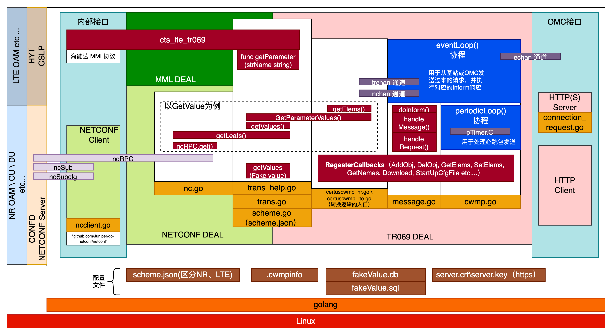
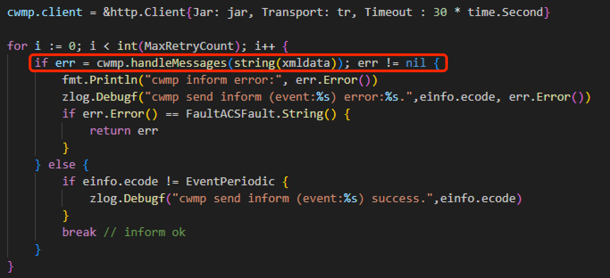

# 基站TR069南向接口

# 1 概述
## 1.1 前提条件
- 基站NR系列进程内部的管理软件和数据模型选用了非常成熟稳定的CONFD（即NETCONF + YANG）作为内部数据库，管理协议
- 基站LTE系列进程直接采购自海能达，海能达的管理框架选用MML+SQLite作为内部数据库，管理协议
- 但是运营商则选用了TR069（或称CWMP）协议作为统一网管（OMC）作为规范纳管全部小基站厂家。

## 1.2 功能列表
为了保证内部NETCONF协议或MML协议不做大幅修改的同时能够和TR069协议较为完善的兼容，最终确定在中间增加一层适配层，完成以下工作：

1. 完成netconf 到 tr069 的相互转换工作
2. 完成MML 到 tr069 的相互转换工作
3. 若出现内部模型定义与运营商规范不匹配地方的时候，在适当的时候由中间转换层进行适配转换
4. 当运营商的tr069数据模型节点，基站内部尚不支持时，由适配层直接返回打桩结果，避免产生向客户的一些不必要的解释工作

该适配层进程名称为：certuscwmp 和 certuscwmp-lte。（由于运营商要求双模基站虽然物理上是一台设备，要分开为两个不同的逻辑站以便于管理）

# 2 接口和软件架构

- TR069协议的详细内容，请参考此文档：[中移动南向接口规范(非实时更新，仅作学习用途)](http://172.21.6.174:4000/Attachment/cmcc-picocell-specification.pdf)

## 2.1 对外（OMC）消息接收接口
- HTTP Server：用于接收OMC反向链接（即6 connection request事件）请求，位于指向CWMP结构体的Run()函数当中
- HTTP Client：用于基站主动向OMC发送消息
  - 注：一切请求均可以理解为从一个http client请求出发，因为即使是"6 connection request事件"，也是由基站主动通过Inform发向OMC的

### cwmp.go简述
- 实现与OMC的HTTP消息对接并分发响应的请求
  - 即：cwmp.doInform() -> cwmp.handleMessages() -> cwmp.handleRequest()

### certuscwmp_xx.go简述
- 进程入口，并触发加载配置文件以及启动流程
- 实现增删改查等cwmp定义的RPC的处理（通过注册回调将cwmp.go中的）

## 2.2 对内接口（NETCONF）
- 三个netconf client实例
  - ncRPC：用于发送增删改查等NETCONF预定义和自定义RPC的netconf client
  - ncSub：用于注册告警等全部自定义notification事件（对应的stream配置在scheme.json当中）
  - ncSubcfg：用于注册netconf提供的notification change事件，转换后用于TR069的AddObject、DelObject、ValueChange的Inform事件

## 2.3 协程列表及其对应通道
- **eventLoop**：用于从基站或OMC发送过来的请求，并执行对应的Inform响应（2 Periodic心跳包除外）
  - 代码位置：tr069 > cwmp > cwmp.go > eventLoop()
  - 对应通道列表和说明
    - echan：暂存OMC发来的Connect request, 初始化启动，即0 BOOT、1 BOOT事件的通道
    - trchan：暂存基站发来的transfer compelete事件的通道
    - nchan：暂存基站发来的notification事件（告警、新增删除修改通知，升级结果通知）的通道
- **periodicLoop**：用于单独发送心跳包（避免其他Inform事件阻塞心跳包）
  - 代码位置：tr069 > cwmp > cwmp.go > periodicLoop()
  - 额外说明：最开始心跳包也在eventLoop中进行处理的，但由于外场出现断网几天，积攒了很多文件待上传。当网络恢复后，有大量的transfer complete的Inform事件积压在trchan中，导致eventLoop协程无法及时处理心跳事件结果导致OMC离线的严重问题

