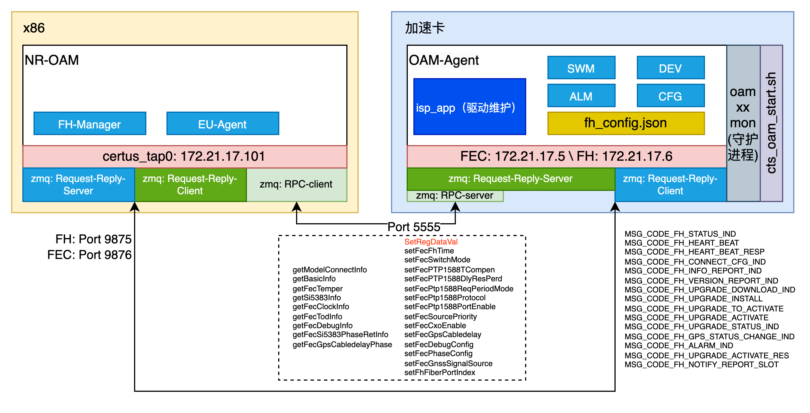

# 前传卡端OAM-Agent总体设计与流程说明

# Change Log
|  Date (YYYY-MM-DD) |  Version | Changed By  |  Change Description |
|---|---|---|---|
| 2024-07-08  | 1.0  | Guoliang  |  创建文档 |

## 1 前传卡基础软件架构说明

通过OAM子系统实现对前传板卡的管理，在OAM-NR添加FH-Manager子模块，在前传卡运行OAM-Agent，采用ZeroMQ方式进行通信
- RPC机制全面参考了开源代码：https://github.com/button-chen/buttonrpc_cpp14
    - RPC机制主要用于和前传卡设备驱动层、FPGA交互
    - 红色的SetRegDataVal为通用的FPGA寄存器设置RPC，可供基站侧直接通过FPGA的寄存器偏移地址进行配置
    - 如果你想要在基站侧给前传卡进行配置后，由前传卡执行一些内部逻辑，可以参考图中非红色的SetRegDataVal的RPC机制
- 普通的ZeroMQ Request-Reply机制，可参考图中消息宏，实现了最基础的心跳、告警、升级等OAM功能
- fh_config.json用于设备内部简单的持久化存储功能
- cts_oam_start.sh由设备上电后自动调用执行，以便启动守护进程mon和agent进程

   

## 2 业务逻辑流程说明

### 2.1 前传卡升级流程
TODO

