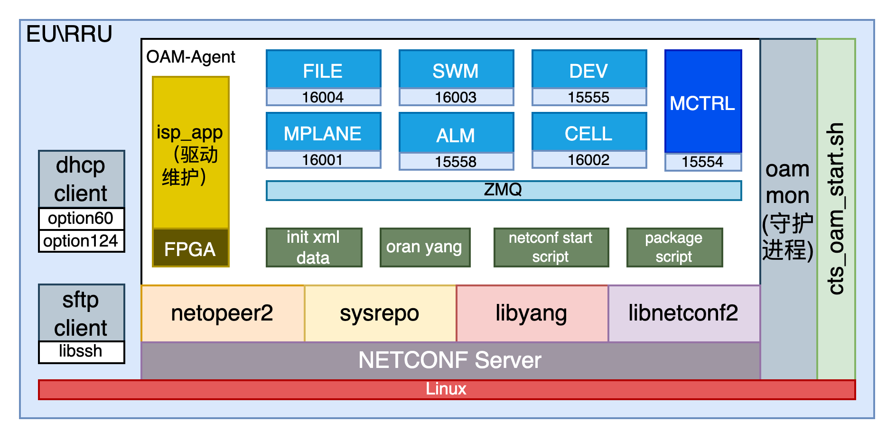
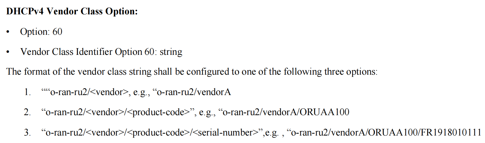

# EU,RRU设备OAM软件总体设计实现说明

# Change Log
|  Date (YYYY-MM-DD) |  Version | Changed By  |  Change Description |
|---|---|---|---|
| 2024-07-18  | 1.0  | Guoliang  |  创建文档 |

## 基准
OAM在EU、RRU上的设计，基于ORAN规范，原文：[O-RAN.WG4.MP0-v03.00](http://172.21.6.174:4000/Attachment/O-RAN.WG4.MP.0-v03.00.pdf)


## 1. OAM-Agent基础软件架构说明



自研EU、RRU设备，对外的消息接口使用了ORAN规定的NETCONF协议。内部则使用了ZeroMQ进行模块间的通信
- EURRU侧符合ORAN标准，为NETCONF Server
- 内部模块间通过ZeroMQ消息通信，但当前模块并未实现基站侧的线程池机制。所有模块均为单线程对消息进行处理
- cts_oam_start.sh由设备上电后自动调用执行，以便启动守护进程mon和agent进程
- RRU通过启动后发送DHCP广播向服务器请求IP地址，该行为由驱动触发并维护
- 设备通过sftp协议传输包括在升级包在内的所有文件

### 1.1 内部消息交互
- 内部消息通过每个模块实现一个ZeroMQ Socket Server实现，每个模块均被分配一个接收端口，如上图。
- 每个模块只有一个线程来接受发送自其他模块的消息指针，
  - 由于使用ZMQ的REP机制，在处理消息之前答复发送方标记的消息序号，随后处理该消息
  - （限制）每个模块一次只能处理一条消息，**在消息未处理完成前，其他客户端发送的消息将阻塞**，若是高消耗处理或异步则需要自行（通过开辟新线程或其他方式）实现

消息接收通过以下函数实现：
```c++
void* Modules::main(void* args)
```

消息发送通过以下函数实现：
```c++
/*
 * Description: Send a message based on the source destination module
 * src: source module id
 * dst: destination module id
 * timeout: message timeout (second)
 * Msg: message content head
 */
void MsgHelper::send(RRUModulesE src, RRUModulesE dst, int timeout, std::shared_ptr<RruMessage> Msg)
```


## 1.2 外部消息交互
### 1.2.1 DHCP获取本机IP地址以及Callhome地址
- 本机通过-V选项发送带有option 60的dhcp报文来向server端告知“供应商类标识符”(参考以下dhcpc命令，该命令由设备侧驱动在开机后自动触发)
- 本机通过发送请求option 43的dhcp报文来获取服务器信息

```shell
udhcpc -R -b -p /var/run/udhcpc.eth0.pid -I eth0 -V o-ran-ru/CTS/EU -O 43
# 1. udhcpc:
# 这是一个轻量级的 DHCP 客户端，用于从 DHCP 服务器获取 IP 地址和其他网络配置。
# 2. -R:
# 这个参数指示 udhcpc 不要在租约时间到期后自动续租。也就是说，当租约时间结束时，udhcpc 不会尝试自动续租，而是等待用户手动续租。
# 3. -b:
# 这个参数指示 udhcpc 在成功获取 IP 地址后转入后台运行。这使得它不会占用终端，并且可以继续运行其他命令。
# 4. -p /var/run/udhcpc.eth0.pid:
# 这个参数指定 udhcpc 将进程 ID (PID) 写入到 /var/run/udhcpc.eth0.pid 文件中。这对于管理和终止 udhcpc 进程非常有用，因为可以通过读取这个文件获取 udhcpc 的 PID。
# 5. -I eth0:
# 这个参数指定 udhcpc 使用 eth0 接口。这意味着 udhcpc 将通过这个网络接口发送 DHCP 请求并接收响应。
# 6. -V o-ran-ru/CTS/EU:
# 这个参数指定 udhcpc 发送的 vendor-class-identifier (供应商类标识符) 为 o-ran-ru/CTS/EU。这个选项通常用于指定设备类型或供应商特定的信息。
# 7. -O 43:
# 这个参数指示 udhcpc 请求 DHCP 服务器发送选项 43 (Option 43) 的值。Option 43 通常用于传递供应商特定的信息。
```

该协议要求来自[O-RAN.WG4.MP0-v03.00](http://172.21.6.174:4000/Attachment/O-RAN.WG4.MP.0-v03.00.pdf)规范：




<br><br><br>

## 2. 配置管理
- 回调函数入口：sys > config > src > **confd_mgr.cpp** > () sys > init()
```c++
void ConfdMgr::init()
{
    initFlag = true;
    reg_system_management_function();          // o-ran-system-management
    reg_interfaces_function();                 // o-ran-interfaces
    reg_delay_management_ru_cpri_function();   // o-ran-delay-management-ru-cpri
    reg_software_management_function();        // o-ran-software-management
    reg_uplane_conf_function();                // o-ran-uplane-conf
    reg_file_management_function();            // o-ran-file-management
    reg_mplane_int_function();                 // o-ran-mplane-int
    reg_operations_function();                 // o-ran-operations
    reg_test_function();
    initFlag = false;

    load_default_sysrepo_config();

    return;
}
```

### 2.1 新增或修改yang模型流程
#### 2.1.1 配置节点


#### 2.1.2 状态节点
#### 2.1.3 RPC
#### 2.1.4 Notification


