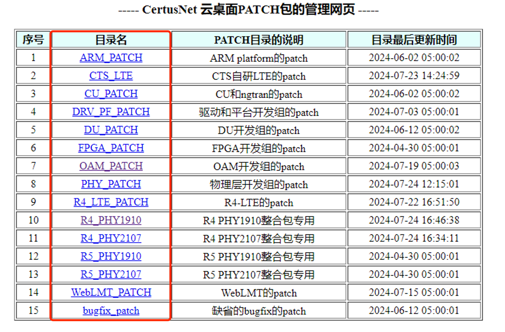

# 入职配置和需要了解的各种权限

1. 安装个人电脑必备软件（公司政策可自备台电脑，每月100元补助，具体流程可咨询IT同事 - 北京:刘海军，南京:xxx）
   - 企业微信 — 必须
   - SSH客户端（推荐moba-xterm或Termius 不要安装xshell、Putty等需要破解的软件）— 必须
   - WPS（不要安装破解版的Office）— 必须
   - 云桌面客户端（参见下条说明）— 必须
   - 邮箱客户端（网易邮箱大师，FoxMail等）— 条件必选（若能保证周期检查网页邮件，也可不安装）
   - 其他：draw.io、向日葵、tortoise svn等
2. 申请或确认开发环境，即windows云桌面：
   -  仔细阅读云桌面使用说明，并做好相关配置：http://192.168.10.67:8090/pages/viewpage.action?pageId=98946
   -  项目Git服务器地址：http://172.21.27.166 （云桌面内访问）自行注册账号后通知管理人员增加OAM代码权限
   -  安装和配置你认为必要的开发相关软件
3. 确认或创建个人OAM Linux开发编译虚拟机：
   -  IP地址，用户名密码将会由管理人员私信或邮件通知，若没有，请参考第二条当中的说明方法
   -  Linux编译虚拟机的创建方法，请参考 [开发虚拟机列表与管理办法](./server_manager.md) 当中的 **第四章节**，即“4 利用现有虚拟机模版在云桌面环境下创建新虚拟机”
   -  克隆oam主程序，并使用vs-code连接代码并编译成功
   -  **重要！**：修改git显示用户名和邮件(默认用户名是OAM_TMP)
    ```
    git config --global user.name "[your name]"
    git config --global user.email "[your email]"
    ```
4.  确认办公网段常用权限或地址可用
   - 5G项目BUG平台：bugzilla：http://172.21.6.108/bugzilla/  （办公机访问，权限问题可企业微信咨询付家锋）
   - 项目文档SVN地址：http://172.16.33.5/svn/5G/Documents/common  （办公机访问，权限问题可企业微信咨询袁野）
   - 确认内网Jinkins：http://192.168.10.62:8728/  （办公机访问，权限问题可企业微信咨询付家锋）
   - 上海文件共享以及版本整包发布服务器(samba): \\\192.168.10.62  （办公机访问，用户名密码：root/123.com）
   - 北京办公文件共享服务器：sftp: 172.21.6.2 （办公机访问，用户名/密码：oran / orte@123!）
   - OAM组内GIT服务器：http://172.21.6.179:8099/ （办公机访问，自行注册后通知管理员添加权限）
   - OAM组内文件共享服务器(samba)：\\172.21.6.174  （办公机访问，用户oam，密码：oam@123）
5. 办公机->云桌面文件传输方法
   -  将你的文件上传到 \\\192.168.10.62\loadbuild\upload_files_to_cloud  （Samba账号：root，密码：123.com）
   -  访问以下Jenkins路径，点击“立即构建”触发 Jenkins Job
      - Jenkins路径：http://192.168.10.62:8728/view/upload_file_to_cloud_desktop/job/upload_files_to_cloud_certusnet/
   -  登陆到云桌面：
      -  检查该地址：sftp://172.21.28.2/certusnet 中的zip文件（账号sangfor，密码：Debug@123）
6. 云桌面->办公机文件传输方法
   - 该方法主要用于编译结果（测试版本或Release）的发布，所有虚拟机均已安装好任意路径可执行的bin文件，直接执行即可：
    ```
    upload_tgz_to_cts_loadbuild [你的文件] [目标地址]
    # 例子：
    upload_tgz_to_cts_loadbuild cwmp_trans_15ca7fc-cmcc-24-0723-1927.tgz OAM_PATCH
    ```
   - 访问 http://172.21.6.36:5555/cts_loadbuild/ 对应的目标地址寻找你上传的文件。可用目标地址可见下图：

