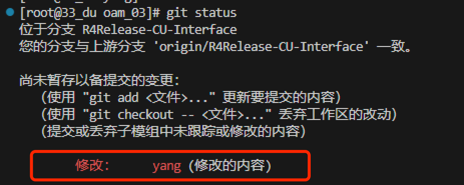

## 整包发布说明
软件包发布，使用统一的路径，需要遵循规范发布，这样才能够被打包脚本正确解析，并输出

- 当前打包脚本已经由项目经理负责，并且被放置在Jenkins服务器当中

### 各个组件需要遵循以下规则发布
1. 必须发布tar格式压缩包，使用tar czvf的形式进行压缩
2. 压缩必须带有目录，即解压后第一级为目录
3. 压缩内容与所运行时的目录结构必须一致
4. 文件名中包含该次发布的组件内部版本
   - 位于下划线后，如果发布的组件是gnb_oam，则发布组件名称必须遵循：（）
5. 如果存在依赖库，请放于发布目录下的x86Release/libs文件夹，并修改makefile已rpath指定

**注：OAM组的全部组件均已完成编译脚本，即可以做到一键发布**

## 组件发布流程和注意事项
- 发布之前，先明确有**哪些组件**在这个发布周期内被修改了
- 发布之前，先明确修改内容所对应的**问题单**
  - 可以在组件对应的提交记录中寻找问题单，或咨询对应的开发同事
  - 若没有问题单，可以单独使用文字说明，也可以自提问题单（根据实际情况灵活掌握即可）
- 编译时，要确认代码是否已经更新到最新
- 编译后，要及时更新对应的发布说明页面(请根据实际项目情况动态调整页面分布)，当前三个项目的地址如下：
  - R4: http://192.168.10.67:8090/pages/viewpage.action?pageId=21760752
  - R5: http://192.168.10.67:8090/pages/viewpage.action?pageId=31064355
  - 直放站: http://192.168.10.67:8090/pages/viewpage.action?pageId=41550055


## OAM组件发布方法

### oam yang模型
在发布gnb_oam之前，一定要确认gnb_oam对应的yang模型是否有更新，若有更新需要一起发布。

由于yang模型是gnb_oam的submodule，所以如果有同事更新了submodule yang，但是没有更新对应的submodule yang的对应版本文件，就可以看到差异，如下：


yang模型编译发布流程如下：
```shell
cd yang/develop/yang/
./gen_fxs.sh
# ./release_confd.sh [本地路径（自动创建）] [目标路径，即http://172.21.6.36:5555/cts_loadbuild/]
./release_confd.sh /home/release/R4/wk32/ OAM_PATCH
```

### gnb_oam
gnb_oam的编译发布流程如下：
```shell
git pull
cd build/
./build_release.sh
# ./package_oam.sh [本地路径（自动创建）] [目标路径，即http://172.21.6.36:5555/cts_loadbuild/]
./package_oam.sh /home/release/R4/wk32/ OAM_PATCH
```


