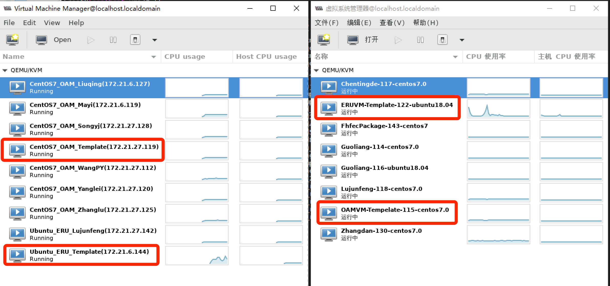
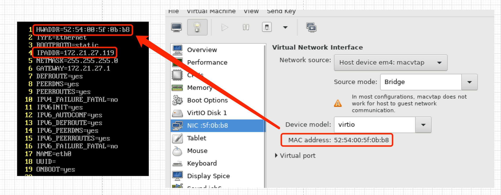
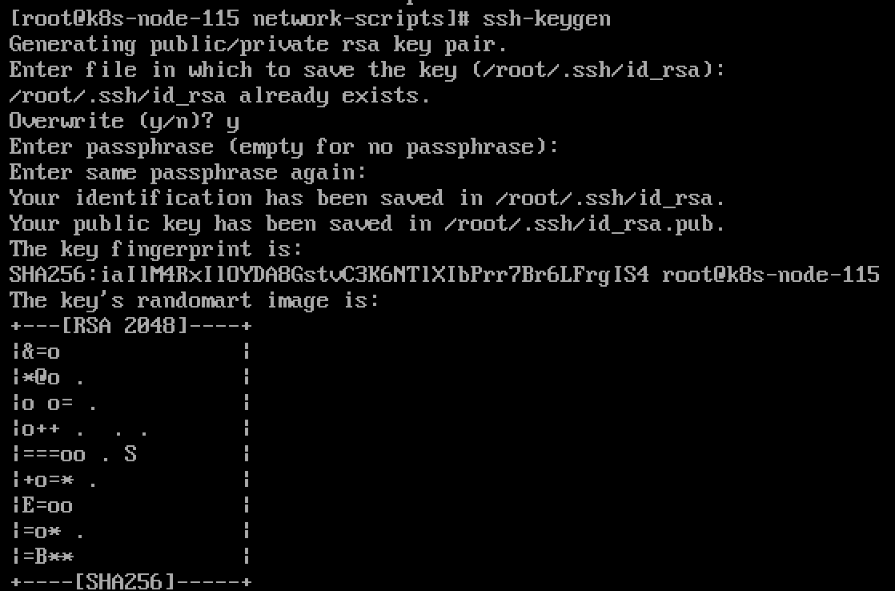

# 1 云桌面网络
云桌面为172.21.27.0/24网段，使用aTrust启动windows虚拟机后可以访问的所有服务，由于代码安全问题，所有扩展型皮基站相关代码编译开发均在此进行

## 1.1 物理机列表
| 机器名称          | 配置             | 用户名密码           | IP地址        |
| ----------------- | ---------------- | -------------------- | ------------- |
| 组内虚拟机宿主机1 | 64CPU-总内存128G | root \ certusnet@33  | 172.21.27.33  |
| 组内虚拟机宿主机2 | 24CPU-总内存128G | root \ certusnet@44  | 172.21.27.44  |
| 自研LTE编译服务器 | 24CPU-总内存64G  | root \ certusnet@178 | 172.21.27.178 |
| 自研LTE编译服务器 | 24CPU-总内存64G  | root \ certusnet@176 | 172.21.27.176 |

## 1.2 云桌面内宿主机1（172.21.27.33）虚拟机列表

| 机器名称      | 配置     | IP地址        |
| ------------- | -------- | ------------- |
| OAM_Mayi      | 8CPU-12G | 172.21.27.119 |
| OAM_Liuqing   | 8CPU-12G | 172.21.27.127 |
| OAM_Wangpy    | 8CPU-12G | 172.21.27.112 |
| OAM_Yanglei   | 8CPU-12G | 172.21.27.120 |
| OAM_Zhanglu   | 8CPU-12G | 172.21.27.125 |
| OAM_Songyj    | 8CPU-12G | 172.21.27.128 |
| ERU_Lujunfeng | 8CPU-8G  | 172.21.27.142 |
| ERU_Template  | 4CPU-2G  | 172.21.27.144 |
| OAM_Template  | 4CPU-2G  | 172.21.27.119 |

## 1.3 云桌面内宿主机2（172.21.27.44）虚拟机列表

| 机器名称          | 配置     | IP地址        |
| ----------------- | -------- | ------------- |
| OAM_Guol          | 8CPU-16G | 172.21.27.114 |
| ERU_Guol          | 6CPU-8G  | 172.21.27.116 |
| OAM_Chentingde    | 6CPU-12G | 172.21.27.117 |
| OAM_Lujunfeng     | 6CPU-12G | 172.21.27.118 |
| OAM_Zhangdan      | 6CPU-12G | 172.21.27.130 |
| FhFec_Package_143 | 4CPU-4G  | 172.21.27.143 |
| ERU_Template      | 4CPU-2G  | 172.21.27.1xx |
| OAM_Template      | 6CPU-4G  | 172.21.27.115 |

### 参考初始用户名密码：
OAM_xxx开头的虚拟机为基站系列软件开发虚拟机，参考初始用户密码：
- 用户名：root
- 密码：CertusNet.123

ERU_xxx开头的虚拟机为EU、RRU软件开发虚拟机，参考初始用户密码：
- 用户名：root
- 密码：CertusNet.123
- 用户名2：rru-oam
- 密码2：oam@123


# 2 办公网络
办公网段为172.21.6.0/24，该网段具备公网访问能力，主要用于全部测试线服务器、OAM组内Samba共享网盘、GitLab、GitBook等服务，直放站代码编译虚拟机由于需要外部合作，故也安排至办公网中

## 2.1 内重要物理机（测试线，OMC，虚拟机宿主机）列表

| 机器名称            | 用途                                                  | IP地址       |
| ------------------- | ----------------------------------------------------- | ------------ |
| Intel40核，2U服务器 | OAM V3+1910测试线（NR+LTE双模，OAM组内资产）                | 172.21.6.76  |
| Intel14核，1U服务器 | OAM V4+2107测试线（NR单模，OAM组内资产）                    | 172.21.6.124 |
| Intel24核，2U服务器 | V3+1910测试线（NR+LTE双模，测试组资产，可能随时取消）          | 172.21.6.228 |
| 185-OMC服务器       | OMC+OAM办公公网虚拟机宿主机 （测试组资产）                   | 172.21.6.185 |
| 215-OMC服务器       | 北京OMC （测试组资产）                                    | 172.21.6.215 |
| 实验室内的办公PC    | 可用于OAM组内板卡调试（可远程桌面连接）                        | 172.21.6.127 |

## 2.2 办公网（宿主机172.21.6.185）虚拟机列表

| 机器名称      | 用途                       | IP地址与访问方式 |
| ------------- | -------------------------- | ---------------- |
| 郭亮          | 直放站编译开发虚拟机       | 172.21.6.176     |
| 王沛瑶        | 直放站编译开发虚拟机       | 172.21.6.177     |
| 杨磊          | 直放站编译开发虚拟机       | 172.21.6.178     |
| 柳青          | 直放站编译开发虚拟机       | 172.21.6.175     |
| GitLab        | 直放站永鼎合作开发GitLab   | 172.21.6.179     |
| Samba\GitBook | OAM组内Samba\GitBook服务器 | 172.21.6.174     |
| OAM预留       | 直放站编译开发虚拟机预留   | 172.21.6.184     |


## 2.3 办公网段相关服务说明以及用户名密码

1. GitLab（办公网段，主要用于直放站开发和文档存放）
    - 内网地址：http://172.21.6.179:8099/
    - 外网地址：http://221.219.15.154:8017/
    - GitLab服务器超级管理员用户名密码：root \ t8dXV3IxeRkoRWLLAQ1lbXkG6JYmEj5gMblSz9nNHs4=
    - 虚拟机SSH登录的用户名密码：oam \ CertusNet.123
    - 虚拟机超级管理员（sudo, root）密码：CertusNet.123
2. 组内Samba共享网盘
    - 地址：\\172.21.6.174
    - Samba访问用户名密码：oam\oam@123
    - 虚拟机SSH登录的用户名密码：oam \ CertusNet.123
    - 虚拟机超级管理员（sudo, root）密码：CertusNet.123
3. 直放站编译虚拟机参考的用户名密码：oam \ CertusNet.123 或 root\CertusNet.123
4. 组内实验室PC机Windows登录密码：oam \ CertusNet.OAM127-Pc
    - 向日葵：558 786 236（Qaz1234）


<br><br><br><br>

# 3 附：如何管理个人虚拟机

有时可能由于宿主机被掉电等原因导致的个人虚拟机关机问题，可参考下边的操作流程：
(个人虚拟机所属哪个宿主机，请见上边的虚拟机列表表格)

## 操作流程（virt-manager可视化界面）：

1. 登录至对应宿主机（MobaxTerm等支持GTK图形化工具的Shell工具）
2. 使用命令virt-manager，并等待管理界面出现
3. 自己根据需求调整、重启等


## 命令行管理

| 命令                                | 作用                                   |
| ----------------------------------- | -------------------------------------- |
| virsh list --all                    | 列出当前所有虚拟机，以及状态           |
| virsh start [vm name]               | 启动该虚拟机                           |
| virsh reboot [vm name]              | 重启虚拟机                             |
| virsh suspend [vm name]             | 暂定，挂起虚拟机                       |
| virsh resume [vm name]              | 唤醒虚拟机机至running状态              |
| virsh shutdown [vm name]            | 关闭虚拟机                             |
| virsh destroy [vm name]             | 强制关闭虚拟机，shutdown无法关闭时使用 |
| virsh save [vm name] [file name]    | 将虚拟机的运行状态存储到[file name]中  |
| virsh restore [vm name] [file name] | 恢复                                   |
| virsh domblklist [vm name]          | 查看虚拟机镜像所在路径                 |

<br><br><br><br>


# 4 利用现有虚拟机模版在云桌面环境下创建新虚拟机
（主要为新员工创建虚拟机）
### 第一步：找到合适的IP地址
云桌面网段为172.21.27.0/24，在此网段寻找一个无法ping通的地址后，确定该IP地址。

### 第二步：确认宿主机
如第一张表格所示，当前有两台虚拟机宿主机，即27.33和27.44，请根据实际负载情况选择对应的宿主机。宿主机用户名密码也请参考第一张表

### 第三步：克隆虚拟机模板

#### 利用mobax启动虚拟机管理界面
```shell
virt-manager
```


- 有两个类型的虚拟机模板，分别是：
  - centos：主要用于NR基站系列进程（gnb_oam、守护进程、cwmp_trans等）的开发工作
  - ubuntu：主要用于自研EU、RRU的开发工作
- 两台宿主机，四个虚拟机模板如下：




#### 克隆
关闭对应的虚拟机模板


直接选择对应的模板右键克隆即可。由于磁盘大小为100G，所以等待时间较长


### 第四步：启动并修改新虚拟机配置
#### 修改第一步确定的IP地址(Centos)
```shell
cd /etc/sysconfig/network-scripts/
vim ifcfg-eth0 # 修改网口mac地址和ip地址，见下图
service network restart
```




#### 修改第一步确定的IP地址(ubuntu，无需修改mac地址)
```shell
cd /etc/network
vim interfaces
reboot
```

#### 刷新ssh-key
```shell
ssh-keygen
```




#### 刷新机器名称(可选)
```shell
vim /etc/hostname
```


<br><br><br><br>


# 5 附：各类服务自启动

## KVM虚拟机自启动
### 以启动185服务器GitLab服务的虚拟机为例：

```shell
vim /etc/systemd/system/oam_gitlab.service
```

```ini
[Unit]
Description=Autostart KVM virtual machine gitlab
After=network.target libvirtd.service
Requires=libvirtd.service

[Service]
Type=simple
ExecStart=/usr/bin/virsh start gitlab_ubuntu20.04_172.21.6.179
Restart=always
RestartSec=10

[Install]
WantedBy=multi-user.target
```

重新加载 `systemd` 配置

```sh
sudo systemctl daemon-reload
```

启用并启动服务

启用并启动 `oam_gitlab.service` 服务：

```sh
sudo systemctl enable oam_gitlab.service
sudo systemctl start oam_gitlab.service
```

### 以185服务器批量启动多台直放站开发KVM虚拟机为例：
```sh
sudo vim /etc/systemd/system/start-vms.service
```

1. 在文件中添加以下内容：

```ini
[Unit]
Description=Start multiple KVM virtual machines at boot
After=network.target libvirtd.service
Requires=libvirtd.service

[Service]
Type=oneshot
ExecStart=/usr/local/bin/start-vms.sh
ExecStop=/usr/local/bin/stop-vms.sh
RemainAfterExit=yes

[Install]
WantedBy=multi-user.target
```

2. 创建启动脚本

```sh
sudo mkdir -p /usr/local/bin/
sudo vim /usr/local/bin/start-vms.sh
```

3. 在文件中添加以下内容：

```sh
#!/bin/bash

# 启动指定的虚拟机
virsh start Guoliang_ubuntu20.04_172.21.6.176
virsh start Liuqing_ubuntu20.04_172.21.6.175
virsh start Mazhe_ubuntu20.04_172.21.6.177
virsh start oam_ubuntu20.04_booster-vm-base
virsh start Yanglei_ubuntu20.04_172.21.6.178
```

4. 保存并关闭文件，然后为脚本添加可执行权限：

```sh
sudo chmod +x /usr/local/bin/start-vms.sh
```

5. 重新加载 `systemd` 配置

```sh
sudo systemctl daemon-reload
```

6. 启用并启动服务

启用并启动 `start-vms` 服务：

```sh
sudo systemctl enable start-vms.service
sudo systemctl start start-vms.service
```


## 虚拟机内的相关服务自启动
### gitlab（172.21.6.179）自启动和状态
配置文件位置，查看状态：
```shell
cd /etc/systemd/system
# gitlab-docker.service

# 查看状态
systemctl status gitlab-docker.service
```

配置文件内容：
```ini
[Unit]
Description=GitLab Docker Container
After=docker.service
Requires=docker.service

[Service]
Restart=always
ExecStart=/usr/bin/docker start -a gitlab
ExecStop=/usr/bin/docker stop -t 2 gitlab

[Install]
WantedBy=multi-user.target
```

### gitbook(172.21.6.174)自启动和状态
配置文件位置，查看状态：
```shell
cd /etc/systemd/system
# gitbook.service

# 查看状态
systemctl status gitbook.service
```

配置文件内容：
```ini
[Unit]
Description=GitBook Service
After=network.target

[Service]
ExecStart=/usr/local/bin/gitbook serve /home/oamGitBook
WorkingDirectory=/home/oamGitBook
Restart=always
User=root
Environment=PATH=/usr/bin:/usr/local/bin
Environment=NODE_ENV=production

[Install]
WantedBy=multi-user.target
```

