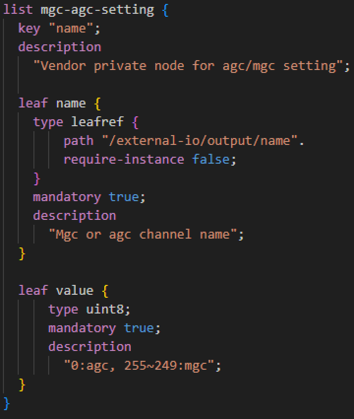
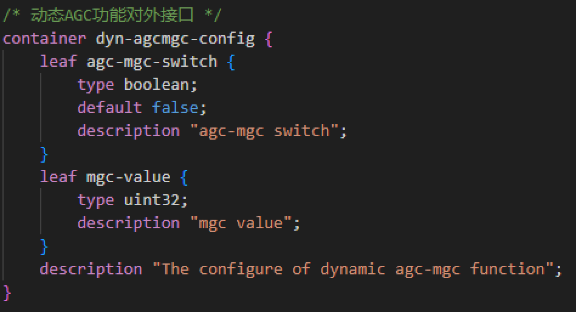
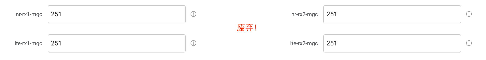
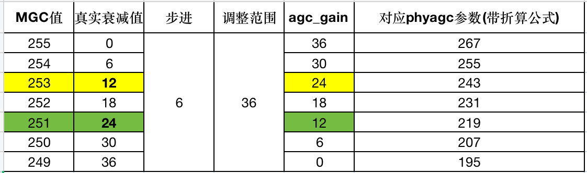

注：此文从 http://192.168.10.67:8090/pages/viewpage.action?pageId=34865974 搬运，过程中难免有一些错误，也可参考原文
# 1. 对外接口说明与模型变更

## 1.1 OAM基站yang模型变更

1. **新增节点**：flexoran-5gnr\rru-manager\comm-switch\rru-plan-type
   1. 数据类型：enum
   2. 默认值：RG-5GNR-pRRU620(N41)-B3 V2
   3. 说明：整站所规划接入的RRU类型，需要具体到RRU型号。此配置影响动态AGC等功能
   4. description: The type of RRU planned to be accessed by the entire station, specific to the RRU model name. This configuration affects functions such as dynamic AGC

2. **新增节点**：flexoran-5gnr\phy-manager\Radio\mgcAgcSwitch
   1. 数据类型：uint16
   2. 默认值：0
   3. 说明：动态AGC，MGC开关（0为关闭AGC，1为打开AGC）
   4. description: Dynamic AGC,MGC switch(0 means turning off AGC, 1 means turning on AGC)

3. **废弃节点**（新增加节点说明添加废弃字样即可）：
   1. /flexoran-5gnr/rru-manager/o-ru-manager-parameter/comm-switch/nr-rx1-mgc
   2. /flexoran-5gnr/rru-manager/o-ru-manager-parameter/comm-switch/nr-rx2-mgc
   3. /flexoran-5gnr/rru-manager/o-ru-manager-parameter/comm-switch/lte-rx1-mgc
   4. /flexoran-5gnr/rru-manager/o-ru-manager-parameter/comm-switch/lte-rx2-mgc

## 1.2 PHY接口及其处理说明

### 1.2.1 PHY对应sub6.xml中新增接口

下表为phy启动时，在sub6.xml中需要新增的对应的三个节点，其中phyAgcSet是已有节点无需关注，另外两个节点为新增节点
* Phy参数需要测试或交付人员提前配置好才能启动站或修改完成后手工触发重启，让配置节点生效

| 节点名称            | 数据类型 | 本次修改节点说明                                                                                 | sub6.xml的scheme路径               |
|------------------|--------|--------------------------------------------------------------------------------|-----------------------------|
| mgcAgcSwitch     | uint16 | 在PhyConfig/Radio节点中新增yang节点，0表示MGC，1表示AGC。此参数会同步至EU、RRU                           | PhyConfig/Radio             |
| phyAgcSet        | uint16 | Phy侧与AGC、MGC相关参数，此参数全权交付人员配置。此参数会同步至EU、RRU（自研EU，锐捷RRU由OAM端进行换算） | PhyConfig/PhyVars/Pusch     |
| radioVendorClassType | NA     | 没有直接可见以让测试、交付人员编辑的节点，即无对应yang节点，根据OAM侧节点rru-plan-type生成（依据表格“1.2.2 RRU类型编号表”） | PhyConfig/Radio             |

### 1.2.2 RRU类型编号表

交付或操作人员需要根据此表中对应的RRU型号，将基站对所接入的RRU型号，**根据第一列“型号”**，填入节点flexoran-5gnr\rru-manager\comm-switch\rru-plan-type（整站所规划接入的RRU类型）。OAM根据此表给出的“RRU类型编号”，自动在生成PHY的sub6配置文件时填入节点radioVendorClassType当中

| 型号            | 型号说明                   | 备注与额外说明                           | RRU类型编号(厂商+单/双模+序号) |
|----------------|------------------------|------------------------------------|-------------------------|
| RC224-D1       | 芯通单模2.6 250mw          | 截止到目前单模2.6均使用这款。老架构9009              | 211                     |
| RC224-D1C-2    | 芯通单模2.6 250mw          | 新架构单模2.6 9020架构，用于移动发货                | 212                     |
| RC224-G7-2     | 芯通单模3.5 250mw          | 老架构9009                              | 213                     |
| RC227-G7       | 芯通单模3.5 500mw          | 新架构单模3.5 9025架构                      | 214                     |
| RC227-G7-2     | 芯通单模2.6 500mw          | 老架构9009                              | 215                     |
| R5C224-3D1     | 芯通双模2.6+1.8 250mw       | 截止到目前双模2.6+1.8均使用这款。老架构9009         | 241                     |
| R5C224-3D1L    | 芯通双模2.6+1.8 9025       | 新架构双模2.6+1.8 9025                   | 242                     |
| R5C224-3D1L-2  | 芯通双模2.6+1.8 9025       | 新架构双模2.6+1.8 9025，用于移动发货              | 243                     |
| RC224-G7L-2    | 芯通单模3.5 250mw          | 复用R5C224-3D1L-2，用于联通                    | 243                     |
| RC224-3DL-2    | 芯通单模3.5+1.8 250mw       | 复用R5C224-3D1L-2，用于联通                    | 243                     |
| R5C224-3DOD1   | 芯通双模2.6+2.3 250mw       | 已经是新架构9025                           | 244                     |
| 5GNR-rru2700V1_10G  | 锐捷双模模块10G             |                                       | 245                     |
| 5GNR-rru2700V2_6G   | 锐捷双模模块B 6G            |                                       | 141                     |
| 5GNR-rru2600V1_6G   | 锐捷单模模块B 6G            |                                       | 142                     |

### 1.2.3 phyAgcSet与RRU侧MGC配置关系说明

**注：**原针对锐捷新增的mgc配置节点（nr(lte)-rx1\2-mgc）需要废弃，根据此表进行换算，全站MGC因子（包括EU、RRU）统一由phyAgcSet控制

| 型号   | 范围       | 步长    | 说明           |
|------|----------|-------|--------------|
| 自研   | 195-255  | 0.5db | 无需折算        |
| 芯通   | 195-255  | 0.5db | 无需折算        |
| 锐捷   | 249-255  | 6db   | 需要测试或折算      |

锐捷RRU需要折算的附加说明：

- 这个参数原来设计的时候还没有锐捷RRU，只有芯通和自研RRU，两类RRU都是AGC值为195-255，步长为0.5db，所以物理层的按照（PhyAgcSet - 195）/ 2得到前端的功率缩放值。
- 后面增加了锐捷RRU，但他的标准和芯通自研不一样采用了AGC值249-255，步长为6db，但当时锐捷RRU调测的时候未告知相关的适配。
- 此处不一样是前段时间聚焦4T4R OTA空口问题的时候发现的。所以在另外一份邮件中讨论了如何将锐捷RRU的AGC折算后配置给phyAgcSet。
- 综合来看，芯通和自研RRU采用相同标准，PhyAgcSet需要乘以下RRU上报的标准不同，锐捷RRU因采用不同的标准，需要折算后配置给PhyAgcSet。
- 另外PhyAgcSet这个参数是因为前端一直无法传输到PHY侧进行功率补偿，所以PHY侧存在此参数让测试或交付OAM来进行配置，但当前动态AGC方案完全落地之后，PHY侧会废弃此参数，AGC和MGC参数均由FH处获取前端AGC值。

## 1.3 芯通RRU接口

| RRU 软件功能   | M面扩展接口命令      | 详细说明            | 备注          |
|--------------|----------------|------------------------|--------------|
| AGC模式切换   | en_agc         | - p1: 0表示关闭AGC 1表示开启AGC 2代表查询 4代表设置为FPGA模式 | 通过 rpc extern-interface下发 |
| AGC始能最大值设置 | set_agc_param | - p1: 1表示set，2表示get
- p2: 通道号，0，1代表NR，2，3代表LTE
- p3: 最大增益值195~255

> 20240124讨论：当`en_agc=0`时，需要配置此值，en_agc非0时，无需配置此值。此配置与EU侧的MGC因子，基站Phy侧AgcSet需要统一。 | 通过 rpc extern-interface下发 |

**对应yang接口文件**：nts-oran-extern-interface@2023-03-09.yang

### 下发接口实例
```ini
1. 下发AGC开关
agc模式的切换: 在netconf扩展接口中，输入命令相同，
参数表示: 0表示关闭AGC 1表示打开AGC 2代表查询 4代表设置为FPGA模式
<extern-interface xmlns="urn:nts:nts-oran-extern-interface:1.0">
    <funcation>en_agc</funcation>
    <paramentlist>
        <parament>1</parament>
    </paramentlist>
</extern-interface>
 
 
附：在telnet 2300中，输入命令 en_agc
P1: Operation type
0 -->MGC, 1 -->AGC by Transceiver, 2 -->Query mode,
3 -->Reset, 4-->AGC by FPGA, step--> set step by P2
 
 
2. 设置agc起控最大门限
在netconf扩展接口中，输入命令相同
参数表示 p1为1表示set，为2表示get；p2为通道号，0、1代表NR，2、3代表LTE；p3为最大增益值195~255；
<extern-interface xmlns="urn:nts:nts-oran-extern-interface:1.0">
    <funcation></funcation>
    <paramentlist>
        <parament>1</parament>
    </paramentlist>
    <paramentlist>
        <parament>0</parament>
    </paramentlist>
    <paramentlist>
        <parament>215</parament>
    </paramentlist>
</extern-interface>
 
附：在telnet 2300中，输入命令 set_agc_param
Note:  P1: operation type  P2: channel index P3: value of gain
           P1: 1 --> set gain
           P1: 2 -->  get gain
       P2: 0/1/2/3 -->  channel index
       P3: set value of gain
```

## 1.4  锐捷RRU接口（已完成，需优化，参考2.1）

- value=0 是表示 AGC
- value为255～249时，表示MGC


## 1.5 自研EU接口
### 1.5.1 EU侧的AGC和MGC模式切换寄存器定义
- 地址：0xa0001128
- 含义与位宽：32bit的寄存器位宽[31:0]
  - bit[31]是控制AGC和MGC切换的使能，为1表示MGC，为0表示AGC
  - bit[3:0]是MGC模式下的MGC因子，只有在bit[31]为1时，MGC因子才有效（MGC因子暂时废弃不使用）
  - 该寄存器默认值是0x80000000，表示默认为MGC模式，MGC因子为0

### 1.5.2 驱动接口
```c
typedef struct eu_dyn_agcmgc_cfg {
    bool agcMgcSwitch;
    unsigned int mgcValue;
} EU_DYN_AGCMGC_CFG;
```

### 1.5.3 EU侧yang模型变更
在文件flexoran-eu-config.yang中新增yang节点如下：




### 1.5.4 MGC因子与基站侧对应RRU的MGC配置关系
经FPGA同事确认，MGC因子暂时废弃不使用


# 2. OAM内部改动说明

## 2.1 AGC\MGC全站开关与AGC、MGC因子
### Phy侧两个节点与EU、RRU侧配置关系
- "/flexoran-5gnr/phy-manager/Radio/mgcAgcSwitch" 作为全站AGC、MGC切换的开关
- "/flexoran-5gnr/phy-manager/PhyConfig/PhyVars/Pusch/phyAgcSet" 作为全站AGC、MGC因子配置

这两个节点共同起到以下三个作用：

1. 作为其基础功能，在phy进程启动之前，生成phy配置文件sub6.xml
2. 当EU接入后，通过此参数配置EU对AGC、MGC开关（参考1.5，TODO 换算公式需要FPGA评估）
3. 当RRU接入后，通过此参数配置RRU对应的AGC、MGC开关（芯通参考1.3，锐捷参考1.4）
    - 锐捷，flexoran-5gnr/phy-manager/Radio/mgcAgcSwitch配置为0时：
        - mgc-agc-setting值要根据phy侧节点phyAgcSet换算得出
        - 换算公式: ((phyAgcSet - 195) * 0.5 / 6) + 249
    - 锐捷，flexoran-5gnr/phy-manager/Radio/mgcAgcSwitch配置为1时：
        - mgc-agc-setting值设置为0
    - 芯通，flexoran-5gnr/phy-manager/Radio/mgcAgcSwitch配置为0时：
        - en_agc需要设置为0
        - set_agc_param值直接从/flexoran-5gnr/phy-manager/PhyConfig/PhyVars/Pusch/phyAgcSet取值
    - 芯通，flexoran-5gnr/phy-manager/Radio/mgcAgcSwitch配置为1时：
        - en_agc需要设置为4
        - set_agc_param值无需配置


# 3 修改点说明（测试、交付同事关注）

## 3.1 基站全部统一节点，即EU，RRU侧的AGC,MGC配置均以PHY侧配置节点为准
1. 废弃之前锐捷RRU对应的四个配置节点，此节点统一由/flexoran-5gnr/phy-manager/PhyConfig/PhyVars/Pusch/phyAgcSet控制，此值配置参考下表
   1. RuijieMGC→phyAgcSet公式：phyAgcSet = ((MGC - 249) * 6) / 0.5 + 195
   2. phyAgcSet→RuijieMGC公式：MGC = (phyAgcSet - 195) * 0.5 / 6 + 249
 


2. 同理，锐捷、芯通、自研RRU，自研EU均不提供AGC、MGC开关和配置，统一由Phy侧两个节点控制：
    1. “/flexoran-5gnr/phy-manager/Radio/mgcAgcSwitch“ 作为全站AGC、MGC切换的开关
    2. "/flexoran-5gnr/phy-manager/PhyConfig/PhyVars/Pusch/phyAgcSet" 作为全站AGC、MGC因子配置

### 3.1.1 基站侧与AGC、MGC相关节点

1. **flexoran-5gnr/rru-manager/comm-switch/rru-plan-type**
   a. 默认值: RG-5GNR-pRRU620(N41)-B3 V2
   b. 说明: 整站所规划接入的RRU类型，需要具体到RRU型号。此配置影响动态AGC等功能
      i. 此节点必须配置，需要配置：
      1. 如果是新开站，这个节点有一个默认值：锐捷双模A，如果不是，则需要物理层得知此RRU的定标等信息，在填写此节点时需要关注
      2. 如果是升级至支持动态AGC的版本，升级后，如果不是锐捷双模A的基站，需要人工修改此值，并且在修改后重启基站（当然自动开站配置完成后，一定需要重启基站）
   c. description: The type of RRU planned to be accessed by the entire station, specific to the RRU model name. This configuration affects functions such as dynamic AGC

2. **flexoran-5gnr/phy-manager/Radio/mgcAgcSwitch**
   a. 默认值: 0
   b. 说明: 动态AGC，MGC开关（0为关闭AGC，1为打开AGC）
   c. description: Dynamic AGC,MGC switch(0 means MGC, 1 means AGC)

3. **flexoran-5gnr/phy-manager/PhyConfig/PhyVars/Pusch/phyAgcSet**
   a. 默认值: 205
   b. 说明: Phy、EU、RRU侧AGC\MGC因子，此节点在mgcAgcSwitch配置为0时会通过OAM换算并同步至EU、RRU侧
   c. description: This node will be synchronized to EU,RRU side when mgcAgcSwitch is set to 0


   # Change Log
|  Date (YYYY-MM-DD) |  Version | Changed By  |  Change Description |
|---|---|---|---|
| 2024-07-22  | 1.2  | Guoliang  |  迁移至GitBook |
| 2024-04-10  | 1.2  | Guoliang  |  终稿完成 |
| 2024-01-26  | 1.1  | Guoliang  |  完成基本内容 |
| 2024-01-19  | 1.0  | Guoliang  |  在Confluence上创建文档 |
