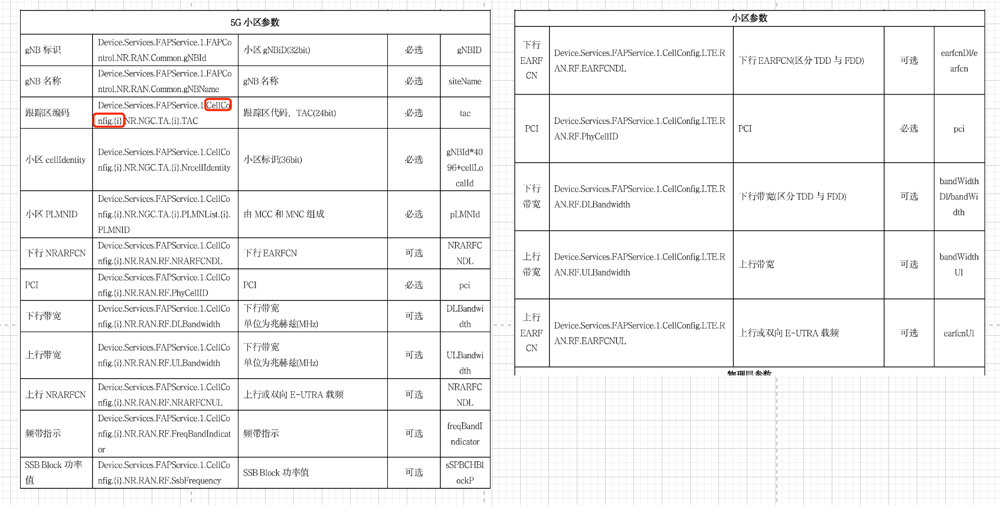
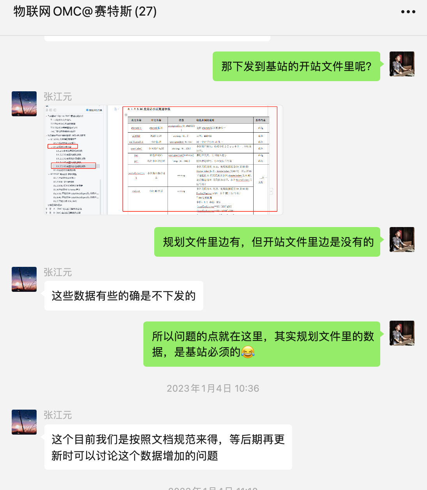

## OMC与海能达多小区
首先可以明确的是，海能达确实是可以支持多小区的，但是就算是移动刷新了规范，支持了多小区，那么海能达的多小区设计理念也大概率和移动的不一致。
- 海能达小区多实例以Cellid做为索引键值，而中移动小区多实例则使用序号作为索引键值。以添加一个cellid为219的小区为例：即没有办法直接添加一个cellid为219的小区实例（因为TR069协议规定先添加再修改），已经添加的海能达小区实例无法再次修改键值Cellid
- 海能达所给出的方案，是每次添加小区时，都是以上一个cellid作为基础，自动+1处理的，根本无法商用

以上，即是目前我们在适配移动南向接口模型时，针对小区这个MO的梳理总结，所以，在OMC上无法对小区模块进行灵活的配置（如动态增删）。

## 符合协议的多小区自动开站
### 从规范角度列出当前的已知问题：
1. 中国移动在自动开站以及南向数据模型当中，没有多小区的设计。（以下截图，左边是5G自动开站要求的参数，右边是4G自动开站要求的参数） 

2. 移动给出的自动开站参数，甚至连enbID和Cellid都没有下发，同时也和移动物联网公司沟通了，记录如下： 

综上，移动的LTE南向数据模型和自动开站规范，还存在很大的GAP，但是移动在短期之内，也没有看到任何能够更新的动作

### 自动开站的Work around
运营商自动开站规范中保留了私有参数的规范定义，用自研或其余厂家OMC的时候，可以利用私有参数的方式(海能达MML)进行我们LTE的自动远程开站。所以**自动开站时可以确定该站点的小区数量以及小区的基本参数**，

## 附录
- 海能达LTE可以正式支持TR069的节点列表集合，可见此腾讯文档（“支持总表MML”sheet页）： 
https://docs.qq.com/sheet/DRUVpVk9sRHR2SE5j?u=77fd9057196c4a0288219df09e43dfd3&tab=000002
